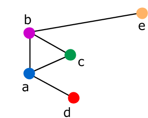
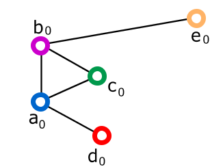
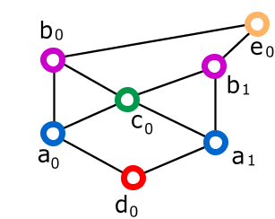
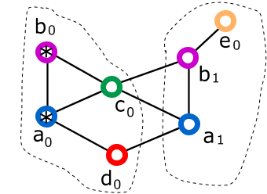
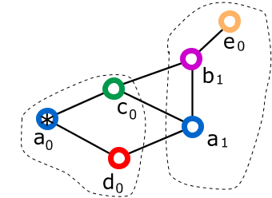

# Modulo Neighborhood - Dettagli Tecnici

1.  [Requisiti](#Requisiti)
1.  [Deliverable](#Deliverable)
1.  [Rilevamento dei vicini, costituzione degli archi, misurazione dei costi](#Rilevamento_dei_vicini.2C_costituzione_degli_archi.2C_misurazione_dei_costi)
1.  [Produzione di uno stub per inviare un messaggio in broadcast](#Produzione_di_uno_stub_per_inviare_un_messaggio_in_broadcast)
1.  [Produzione di uno stub per inviare un messaggio UDP in unicast](#Produzione_di_uno_stub_per_inviare_un_messaggio_UDP_in_unicast)
1.  [Produzione di uno stub per inviare un messaggio reliable ad un vicino tramite un arco](#Produzione_di_uno_stub_per_inviare_un_messaggio_reliable_ad_un_vicino_tramite_un_arco)
1.  [Indirizzo IPv4 di scheda](#Indirizzo_IPv4_di_scheda)
1.  [Proof of concept](#Proof_of_concept)
    1.  [Interazione del programma con l'utente](#Interazione_del_programma_con_l.27utente)
    1.  [Creazione della identità principale](#Creazione_della_identit.2BAOA_principale)
    1.  [Codice id-arco](#Codice_id-arco)
    1.  [Archi identità](#Archi_identit.2BAOA-)
    1.  [Creazione di nuove identità, rimozione di vecchie identità](#Creazione_di_nuove_identit.2BAOA.2C_rimozione_di_vecchie_identit.2BAOA-)

## <a name="Requisiti"></a>Requisiti

L'utilizzatore del modulo Neighborhood per prima cosa inizializza il modulo richiamando il metodo statico
*init* di NeighborhoodManager. In tale metodo viene anche passata l'istanza di ITasklet per fornire
l'implementazione del sistema di tasklet.

Dopo istanzia il suo NeighborhoodManager passando al costruttore:

*   La callback per gestire gli IdentityAwareUnicastID (*get_identity_skeleton*).
*   La callback per gestire gli IdentityAwareBroadcastID (*get_identity_skeleton_set*).
*   Lo skeleton per gestire gli WholeNodeUnicastID e gli WholeNodeBroadcastID (*node_skeleton*).
*   Il numero massimo di archi (int *max_arcs*).
*   La stub factory (istanza di INeighborhoodStubFactory *stub_factory*).
*   Il manager di indirizzi (istanza di INeighborhoodIPRouteManager *ip_mgr*).

Dopo, per ogni interfaccia di rete che intende gestire, richiama sul NeighborhoodManager il metodo
*start_monitor(nic)*, dove *nic* è una INeighborhoodNetworkInterface.

In seguito l'utilizzatore del modulo può aggiungere altre interfacce di rete da gestire, oppure rimuovere
una interfaccia con il metodo *stop_monitor(dev)*, dove *dev* è il nome dell'interfaccia.

Esiste anche un metodo *stop_monitor_all()* per rimuovere tutte le interfacce chiamando su ognuna
lo stesso *stop_monitor*. Questo può essere chiamato dall'utilizzatore prima di dismettere il NeighborhoodManager.  
Il metodo potrebbe anche essere chiamato nel distruttore della classe NeighborhoodManager. Però le
operazioni delle varie chiamate *stop_monitor* causano l'emissione di segnali che possono essere importanti da
gestire, come `nic_address_unset`. Tali segnali non sarebbero ricevuti dall'utilizzatore se fossero emessi
durante l'esecuzione del distruttore della classe. Per questo si preferisce non implementare la chiamata
a *stop_monitor_all* nel distruttore della classe, ma piuttosto demandarla all'utilizzatore.

## <a name="Deliverable"></a>Deliverable

Il modulo segnala l'avvenuta assegnazione dell'indirizzo di scheda ad una interfaccia di rete gestita
attraverso il segnale `nic_address_set` di NeighborhoodManager.

In tale segnale viene riportato:

*   Il nome dell'interfaccia di rete. Una stringa `dev`. Es. "eth0".
*   L'indirizzo assegnato. Una stringa `address`. Es. "169.254.23.45".

* * *

Il modulo segnala la costituzione di un arco attraverso il segnale `arc_added` di NeighborhoodManager.

In tale segnale viene riportato:

*   L'arco costituito. Un INeighborhoodArc `arc`.

Il segnale significa anche che è stata aggiunta nelle tabelle (nel network namespace default) la rotta verso
quell'indirizzo di scheda che è riportato nell'istanza di INeighborhoodArc.

* * *

Il modulo segnala che sta per rimuovere un arco attraverso il segnale `arc_removing` di NeighborhoodManager.

In tale segnale viene riportato:

*   L'arco che sta per essere rimosso. Un INeighborhoodArc `arc`.
*   Un booleano `is_still_usable` che dice se l'arco è ancora utilizzabile per comunicare con il sistema vicino.

Il segnale comunica all'utilizzatore che il modulo sta per rimuovere dalle tabelle (nel network namespace default) la rotta verso
quell'indirizzo di scheda che è riportato nell'istanza di INeighborhoodArc.

Questa notifica avviene in due tipi di situazione. Nel primo caso è perché il modulo si è avveduto da solo
(oppure il suo utilizzatore glielo ha notificato) che l'arco è effettivamente non funzionante. Nel secondo
caso è perché l'utilizzatore ha richiesto al modulo di rimuovere l'arco che ancora si presume essere
funzionante. Il modulo notificando questo segnale `arc_removing` include questa informazione nel booleano
`is_still_usable`.

* * *

Il modulo segnala l'avvenuta rimozione di un arco attraverso il segnale `arc_removed` di NeighborhoodManager.

In tale segnale viene riportato:

*   L'arco rimosso. Un INeighborhoodArc `arc`.

Il segnale significa anche che è stata rimossa dalle tabelle (nel network namespace default) la rotta verso
quell'indirizzo di scheda che è riportato nell'istanza di INeighborhoodArc.

* * *

Il modulo segnala la variazione del costo di un arco attraverso il segnale `arc_changed` di NeighborhoodManager.

In tale segnale viene riportato:

*   L'arco. Un INeighborhoodArc `arc`.

* * *

Il modulo segnala l'avvenuta rimozione dell'indirizzo di scheda ad una interfaccia di rete che non si gestisce
più attraverso il segnale `nic_address_unset` di NeighborhoodManager.

In tale segnale viene riportato:

*   Il nome dell'interfaccia di rete. Una stringa `dev`. Es. "eth0".
*   L'indirizzo assegnato. Una stringa `address`. Es. "169.254.23.45".

* * *

Il modulo permette di ottenere l'elenco degli archi ora presenti con il metodo *current_arcs* di NeighborhoodManager.

* * *

Il modulo fornisce i metodi *get_dispatcher* e *get_dispatcher_set* di NeighborhoodManager per permettere al nodo
di gestire i messaggi unicast e broadcast ricevuti.

* * *

Il modulo fornisce i metodi *get_identity* e *get_node_arc* di NeighborhoodManager per permettere al nodo di
identificare il vicino (*identità* o *nodo*) che ha inviato un messaggio.

* * *

Il modulo permette di ottenere uno stub per inviare un messaggio reliable ad un vicino tramite un arco (o un *arco-identità*)
con il metodo *get_stub_whole_node_unicast* (o *get_stub_identity_aware_unicast*) di NeighborhoodManager.

* * *

Il modulo permette di ottenere uno stub per inviare un messaggio in broadcast con i metodi *get_stub_whole_node_broadcast*
(e *get_stub_identity_aware_broadcast*) di NeighborhoodManager.

* * *

Il modulo permette di forzare la rimozione di un arco con il metodo *remove_my_arc* di NeighborhoodManager.

In questo metodo l'utilizzatore del modulo (o anche il modulo stesso che ne fa uso internamente quando
rileva che l'arco non è più funzionante) può specificare che si possa o meno tentare una ulteriore comunicazione
sull'arco prima di rimuoverlo. Lo si specifica con l'argomento booleano `do_tell`.

## <a name="Rilevamento_dei_vicini.2C_costituzione_degli_archi.2C_misurazione_dei_costi"></a>Rilevamento dei vicini, costituzione degli archi, misurazione dei costi

Quando viene istanziato il NeighborhoodManager il modulo genera il suo NeighborhoodNodeID.

Quando viene chiamato il metodo *start_monitor* sulla istanza di NeighborhoodManager, il modulo inizia a gestire una
interfaccia di rete. Di essa riceve il nome e il MAC address. Per prima cosa verifica che questi valori siano univoci.
Cicla le interfacce che ha già in gestione; se una ha gli stessi valori per nome e MAC allora ignora questa richiesta
che è un duplicato; se una ha lo stesso MAC e nome diverso oppure lo stesso nome e MAC diverso allora il modulo va in errore fatale.

Il modulo, per ogni interfaccia che inizia a gestire, memorizza il suo nome e il suo MAC address e genera e memorizza un
indirizzo locale di scheda. Usa l'oggetto [INeighborhoodIPRouteManager](Requisiti.md#INeighborhoodIPRouteManager)
per impostare l'indirizzo generato. Poi emette il segnale *nic_address_set*.

Poi avvia una tasklet nella quale invia un broadcast_to_dev (cioè un broadcast solo su quella interfaccia di rete) con
il messaggio "ci sono io" indicando il suo NeighborhoodNodeID, il MAC della interfaccia e il suo indirizzo locale di scheda.
Poi ripete lo stesso messaggio con bassa frequenza, ogni minuto.

I nodi che sono nel dominio broadcast vedono questo messaggio e possono fin da subito accordarsi per un arco. Quelli che hanno
già costituito un arco verso quel MAC address ignorano il nuovo messaggio.

Un nodo che vuole accordarsi per un arco con un vicino di cui ha notato la presenza gli invia un messaggio "facciamo un arco"
in UDP unicast, indicando anche esso il suo NeighborhoodNodeID e il MAC e l'indirizzo locale della interfaccia di rete, e
riceverà la risposta. Dopo entrambi i nodi avranno un arco il cui costo è ancora non misurato.

Dopo essersi accordati per l'arco entrambi i nodi usano l'oggetto [INeighborhoodIPRouteManager](Requisiti.md#INeighborhoodIPRouteManager)
per impostare la rotta verso l'indirizzo di scheda del nuovo vicino. Quindi da subito è possibile realizzare connessioni
reliable (con protocollo TCP) tra i due nodi passanti per questo nuovo arco.

Un arco il cui costo non è ancora stato misurato non va a far parte della lista ufficiale che il modulo Neighborhood
espone all'applicazione.

Dopo aver realizzato l'arco entrambi i nodi avviano una tasklet che si occuperà della monitorazione dell'arco e della
misurazione del costo ad esso associato. In questa tasklet viene realizzata subito una prima misurazione e in seguito
ogni 30 secondi si ripete. Nell'effettuare la misurazione si verifica anche il funzionamento stesso dell'arco e se non
funziona viene rimosso.

La misurazione del costo espresso come RTT avviene attraverso l'uso dell'oggetto
[INeighborhoodNetworkInterface](Requisiti.md#INeighborhoodNetworkInterface), come indicato nel relativo documento.

Dopo che è stata fatta la prima misurazione, il modulo emette il segnale *arc_added* e l'arco va a far parte della
lista ufficiale.

Per quanto riguarda la memorizzazione del costo, dopo aver rilevato la prima misurazione l'algoritmo è il seguente:

```
 . costo_nuovo = <costo appena rilevato>
 . costo_memorizzato = costo_nuovo
 . costo_ufficiale = costo_memorizzato
```

Dopo ogni successiva misurazione l'algoritmo è il seguente:

```
 . costo_nuovo = <costo appena rilevato>
 . costo_delta = costo_nuovo - costo_memorizzato
 . se (costo_delta > 0) costo_delta = costo_delta / 10
 . se (costo_delta < 0) costo_delta = costo_delta / 3
 . costo_memorizzato = costo_memorizzato + costo_delta
 . se (costo_memorizzato < costo_ufficiale*0.5 OR costo_memorizzato > costo_ufficiale*2)
     . costo_ufficiale = costo_memorizzato
```

Questo algoritmo fa in modo che lievi variazioni non scatenino pesanti aggiornamenti e traffico di rete. Inoltre tiene
conto della seguente osservazione: se ci sono misurazioni ravvicinate della latenza che differiscono quella più bassa
è quella più vicina alla latenza puramente dovuta alla distanza dei due nodi, mentre quella più alta è stata probabilmente
maggiormente influenzata dal carico del nodo o dal bufferbloat. Nonostante questa osservazione l'algoritmo pian piano
si adegua se le misurazioni si mantengono su un valore elevato.

## <a name="Produzione_di_uno_stub_per_inviare_un_messaggio_in_broadcast"></a>Produzione di uno stub per inviare un messaggio in broadcast

Il modulo Neighborhood riceve dal suo utilizzatore (nel costruttore di NeighborhoodManager) un'istanza di un oggetto di
cui conosce l'interfaccia INeighborhoodStubFactory. Questa ha il metodo get_broadcast che restituisce un oggetto stub di
tipo radice (un IAddressManagerStub) che effettua chiamate broadcast.

Quando vuole trasmettere un messaggio in broadcast il modulo chiama sempre subito prima questo metodo per ottenere uno stub
nuovo. In questo metodo può indicare una istanza dell'interfaccia IAckCommunicator per ricevere dopo il timeout la lista
dei MAC address che hanno segnalato con un ACK la ricezione del messaggio.

Il metodo riceve questi parametri:

*   un ISourceID;
*   un IBroadcastID;
*   un elenco di interfacce di rete (Lista-di-string nics);
*   opzionalmente una istanza di IAckCommunicator.

Un IBroadcastID può avere diverse forme per identificare quali nodi diretti vicini (o quali loro *identità*) siano i
destinatari del messaggio. Individuiamo queste possibili classi che implementano IBroadcastID:

*   EveryWholeNodeBroadcastID. Indica che tutti i nodi che ricevono sono i destinatari del messaggio *di nodo*.  
    Questo è usato dal modulo Neighborhood per i messaggi "ci sono io".
*   WholeNodeBroadcastID. Contiene un set di NeighborhoodNodeID. Indica che solo quei nodi sono i destinatari del messaggio *di nodo*.
*   IdentityAwareBroadcastID. Contiene un set di NodeID. Indica che solo quelle *identità* sono i destinatari del messaggio *di identità*.

Quando il modulo neighborhood (NeighborhoodManager) vuole inviare un messaggio in broadcast:

*   *bcid* = una istanza di IBroadcastID a seconda dei destinatari da raggiungere.

*   *nics* = lista di nomi di NIC a seconda dei destinatari da raggiungere.

*   *comm* = null.

*   se desidera specificare un handler per gli archi che non hanno ricevuto il messaggio:
    *   *missing_handler* = istanza di una classe a sua scelta che implementa INeighborhoodMissingArcHandler.missing come
        vuole; potrebbe essere necessario passare al costruttore un riferimento allo stesso NeighborhoodManager per richiamare
        i suoi metodi, ad esempio ` new NeighborhoodRemoveMissing(this) ` ; oppure, se si ha una callback da richiamare la si
        passa al costruttore, ad esempio ` new NeighborhoodActOnMissing(missing_callback) ` .

    *   *lst_expected* = current_arcs_for_broadcast(nics); cioè memorizza in una lista gli archi che dovrebbero ricevere il messaggio.

    *   comm = new NeighborhoodAcknowledgementsCommunicator ( nics, lst_expected, mgr=this, missing_handler ) ; questa classe
        implementa IAckCommunicator.process_macs_list(Gee.List&lt;string&gt; responding_macs) così:

        *   lst_expected = intersezione(lst_expected, mgr.current_arcs_for_broadcast(nics)); cioè usa nuovamente il metodo
            NeighborhoodManager.current_arcs_for_broadcast; solo gli archi che esistevano prima e esistono ora vanno verificati.

        *   per ogni *missed* in lst_expected tale che missed.mac not in responding_macs:

            *   lancia una nuova tasklet in cui:

                *   missing_handler.missing(missed) ; cioè chiama il metodo 'missing' nell'istanza di
                    INeighborhoodMissingArcHandler, passando l'arco mancato.

*   stub = stub_factory.get_broadcast(bcid, nics, comm).

*   chiama il metodo che vuole sullo stub.

Se si è passata *comm*, l'istanza di IAckCommunicator opzionale, allora la chiamata del metodo remoto deve seguire
immediatamente la creazione dello stub, perché la prima chiamata a current_arcs_for_broadcast viene eseguita subito
e la seconda viene eseguita dopo il timeout che parte al momento della chiamata del metodo remoto.

* * *

Il modulo può aver bisogno internamente di comunicare con i suoi vicini e per questo di produrre uno stub. Oppure lo stub
gli può essere richiesto dall'esterno. In entrambi i casi questo algoritmo sopra delineato viene usato. La differenza sta
nella costruzione della istanza di IBroadcastID.

Uno stub è necessario al modulo Neighborhood quando deve trasmettere un messaggio in broadcast per rilevare nuovi archi o
nodi. In questa occasione quello che serve è un EveryWholeNodeBroadcastID. E non serve un INeighborhoodMissingArcHandler.

Quando uno stub è necessario ad un modulo *di nodo* (che non sia il Neighborhood) quel modulo (o comunque l'utilizzatore del
modulo Neighborhood) deve indicare quali nodi vanno raggiunti. Deve cioè fornire un set di INeighborhoodArc da cui il modulo
Neighborhood estrapola un set di NeighborhoodNodeID con cui compone un WholeNodeBroadcastID. Può inoltre fornire un
INeighborhoodMissingArcHandler. Il metodo pubblico di NeighborhoodManager a questo scopo è *get_stub_whole_node_broadcast*.

Quando uno stub è necessario ad un modulo *di identità* quel modulo (o comunque l'utilizzatore del modulo Neighborhood) deve
indicare quali *identità* vanno raggiunte. Deve cioè fornire un set di NodeID con cui il modulo Neighborhood compone un
IdentityAwareBroadcastID. Può inoltre fornire un INeighborhoodMissingArcHandler. Il metodo pubblico di NeighborhoodManager
a questo scopo è *get_stub_identity_aware_broadcast*.

## <a name="Produzione_di_uno_stub_per_inviare_un_messaggio_UDP_in_unicast"></a>Produzione di uno stub per inviare un messaggio UDP in unicast

L'interfaccia INeighborhoodStubFactory permette permette con il metodo get_unnicast al modulo di ottenere uno stub per inviare
un messaggio UDP (non reliable) ad un particolare vicino tramite una sua particolare interfaccia di rete, dati questi parametri:

*   un ISourceID;
*   un IUnicastID;
*   una interfaccia di rete (string);
*   un boolean per indicare se si vuole attendere la processazione.

Un IUnicastID prodotto per un messaggio da trasmettere in UDP ha solo una forma:

*   NoArcWholeNodeUnicastID. Contiene il NeighborhoodNodeID e il MAC address a cui il messaggio è indirizzato. Solo il nodo
    che ha quel NeighborhoodNodeID e solo quando riceve il messaggio attraverso quella interfaccia, si riconosce come
    destinatario del messaggio *di nodo*. Anche se l'arco non esiste ancora.  
    Questo è usato esclusivamente dal modulo Neighborhood, per i messaggi "facciamo un arco" e "rimuovi un arco".

Il modulo Neighborhood può aver bisogno internamente di comunicare con un suo vicino prima di aver realizzato un arco;
in questo caso produce questo tipo di stub con questo tipo di IUnicastID. Come istanza di ISourceID viene usata una
istanza della classe WholeNodeSourceID.

In seguito, quando vi è un arco tra due nodi vicini, il modulo userà solo comunicazioni con protocollo reliable per
inviare messaggi ad uno specifico vicino. Questa modalità non reliable non viene fornita all'esterno dal modulo.

## <a name="Produzione_di_uno_stub_per_inviare_un_messaggio_reliable_ad_un_vicino_tramite_un_arco"></a>Produzione di uno stub per inviare un messaggio reliable ad un vicino tramite un arco

L'interfaccia INeighborhoodStubFactory permette con il metodo get_tcp al modulo anche di ottenere uno stub per inviare
un messaggio reliable ad un particolare vicino tramite un particolare arco, dati questi parametri:

*   un ISourceID;
*   un IUnicastID;
*   l'indirizzo di scheda del vicino su quell'arco (vedi sotto);
*   un boolean per indicare se si vuole attendere la processazione.

Un IUnicastID prodotto per un messaggio da trasmettere in TCP può avere diverse forme per identificare quale nodo
diretto vicino (o quale sua *identità*) sia il destinatario del messaggio. Individuiamo queste possibili classi che
implementano IUnicastID:

*   WholeNodeUnicastID. Non contiene dati, comunque il messaggio è in TCP quindi sarà processato da un solo nodo e una sola volta.
*   IdentityAwareUnicastID. Contiene un NodeID.

Chiamando un metodo su questo stub viene inviato un messaggio con il protocollo TCP, quindi reliable. Il metodo attende
che il messaggio raggiunga il vicino, ma al momento della produzione dello stub si può specificare se si intende
attendere l'esecuzione del metodo nel nodo vicino oppure no.

* * *

Il modulo può aver bisogno internamente di comunicare con un suo vicino passando per un arco; in questo caso produce
questo tipo di stub. Oppure lo stub gli può essere richiesto dall'esterno.

## <a name="Indirizzo_IPv4_di_scheda"></a>Indirizzo IPv4 di scheda

La comunicazione tra due nodi collegati da un arco deve poter avvenire in modo reliable. Infatti se la comunicazione
risulta impossibile si deve procedere alla rimozione dell'arco stesso. Per implementare la comunicazione reliable si
può far uso del protocollo TCP, ma per questo occorre poter associare ad ogni vertice dell'arco un indirizzo IP fisso.

Si assegna subito un indirizzo "locale" distinto ad ogni scheda di rete del nodo e lo si mantiene sempre, anche quando
il nodo fa l'ingresso in una nuova rete, o migra in un diverso g-nodo, ecc.

L'unico requisito da soddisfare è che tale indirizzo IPv4 sia univoco tra tutti i vicini. Lo scegliamo in modo
random nella classe di indirizzi [169.254.0.0/16](https://en.wikipedia.org/wiki/Link-local_address).

Il caso in cui due nodi vicini si scelgano lo stesso indirizzo è ignorabile.

Quando si aggiunge una interfaccia di rete da monitorare, il modulo genera un nuovo indirizzo IPv4 locale e lo
aggiunge ai suoi indirizzi su questa interfaccia di rete. Per farlo usa l'oggetto passatogli che implementa
l'interfaccia INeighborhoodIPRouteManager, precisamente con il metodo 'add_address'.

Quando si smette di gestire l'interfaccia, il modulo rimuove anche l'indirizzo locale dalla interfaccia, con
il metodo 'remove_address'.

Quando un nodo gestisce una interfaccia di rete, nel messaggio broadcast_to_nic "ci sono io" comunica il suo
indirizzo scelto per quella scheda.

Quando viene realizzato un arco ciascuno dei due nodi:

*   mette l'indirizzo di scheda del vicino come link diretto (associato al suo giusto nic e avendo come source
    preferito il suo indirizzo di scheda) nelle tabelle di routing, con il metodo 'add_neighbor';
*   in una nuova tasklet, periodicamente crea un TCPClient verso l'indirizzo di scheda del vicino e verifica che
    l'arco è ancora funzionante altrimenti lo rimuove.

Alla rimozione di un arco il nodo:

*   rimuove l'indirizzo di scheda del vicino dalle tabelle di routing, con il metodo 'remove_neighbor';
*   rimuove la tasklet che lo monitorava.

Quando si vuole inviare un messaggio ad un vicino attraverso un determinato arco si può usare il TCP verso
l'indirizzo di scheda del vicino memorizzato su questo arco, quindi si ha un collegamento reliable.

## <a name="Ruolo_del_modulo"></a>Proof of concept

Come proof of concept è stato realizzato un programma, **neighborhoodclient**, che si avvale del modulo Neighborhood per:

*   Assegnare *indirizzi di scheda* alle interfacce che gestisce.
*   Individuare e realizzare archi con i nodi vicini.
*   Impostare le rotte verso i diretti vicini.

Si tratta di un programma specifico per un sistema Linux.

Durante l'esecuzione del programma, l'utente può verificare che le rotte verso i diretti vicini vengano correttamente
e tempestivamente realizzate e rimosse (ad esempio se un nodo muore o diventa irragiungibile tramite l'arco).

Il programma consente anche di verificare il modus operandi che è stato individuato
(e descritto nel documento di analisi) per realizzare:

*   La creazione di una nuova *identità*.
*   La creazione di un *arco-identita*.
*   La rimozione di un *arco-identità*.
*   La rimozione di una vecchia *identità*.

Questo programma crea e rimuove anche i network namespace e le pseudo-interfacce da assegnare alle
*identità* che il nodo assume, distinte dalla *principale*.

Il programma fornisce anche una classe che prevede dei metodi remoti come *modulo di identità* e una che
prevede dei metodi remoti come *modulo di nodo*. Tali classi usano il modulo Neighborhood per gestire le
comunicazioni lato client e lato server, L'utente può verificare che un metodo remoto può essere
chiamato da un nodo su un suo diretto vicino. Nel caso del *modulo di identità* può verificare che la giusta
*identità* reagisce sul nodo vicino, ma solo se il corrispettivo *arco-identità* è presente.

Inoltre il programma interattivamente consente di chiedere al modulo Neighborhood le informazioni che ha
raccolto e mostrarle all'utente.

Di seguito descriviamo le operazioni svolte da questo programma. Sarà interessante anche perché alcuni aspetti
analizzati qui saranno ripresi nella realizzazione del demone *ntkd* completo.

### <a name="Interazione_del_programma_con_l.27utente"></a>Interazione del programma con l'utente

Il programma *neighborhoodclient* prevede che l'utente immetta, come argomenti della riga di comando e in modo
interattivo dalla console durante la sua esecuzione, tutti i requisiti del modulo. Anche i parametri che normalmente
sarebbero individuati in modo autonomo dal demone *ntkd* (per esempio l'identificativo delle identità) nel caso
del *neighborhoodclient* sono espressamente indicati dall'utente, questo per rendere più facilmente riproducibili
gli ambienti di test.

I parametri passati all'avvio del programma *neighborhoodclient* sono:

*   first_id
*   max_arcs

I comandi che l'utente può dare interattivamente sulla console del programma *neighborhoodclient* sono:

*   info  
    Sintassi: `info`  
    Mostra le informazioni che il nodo ha.
*   help  
    Sintassi: `help`  
    Mostra un elenco dei comandi.
*   manage-nic  
    Sintassi: `manage-nic <mio-dev>`  
    Inizia a gestire una interfaccia di rete.
*   add-arc  
    Sintassi: `add-arc <id-arco> <mio-id> <suo-id> <suo-mac> <suo-linklocal>`  
    Considerato un arco che il neighborhood ha realizzato, vi aggiunge un arco-identità.
*   change-data-arc  
    Sintassi: `change-data-arc <id-arco> <mio-id> <suo-id> <suo-mac> <suo-linklocal>`  
    Considerato un arco che il neighborhood ha realizzato e un arco-identità che vi è stato già aggiunto,
    modifica i suoi valori di suo-mac e suo-linklocal.
*   prepare-add-id  
    Sintassi: `prepare-add-id <mio-vecchio-id> <mio-nuovo-id>`
*   finish-add-id  
    Sintassi:  
```
        finish-add-id
            [ <id-arco>
                <suo-vecchio-id>
                <suo-nuovo-id>
                <suo-vecchio-id-new-mac>
                <suo-vecchio-id-new-linklocal>] [...] 
```
*   remove-arc  
    Sintassi: `remove-arc <id-arco> <mio-id> <suo-id>`
*   remove-id  
    Sintassi: `remove-id <mio-vecchio-id>`
*   whole-node-unicast  
    Sintassi: `whole-node-unicast <id-arco> -- <argomento>`
*   whole-node-broadcast  
    Sintassi: `whole-node-broadcast <id-arco> [<id-arco> ...] -- <argomento>`
*   identity-aware-unicast  
    Sintassi: `identity-aware-unicast <id-arco> <mio-id> <suo-id> -- <argomento>`
*   identity-aware-broadcast  
    Sintassi: `identity-aware-broadcast <mio-id> <suo-id> [<suo-id> ...] -- <argomento>`

Il significato di comandi e parametri sarà chiarito in seguito.

### <a name="Creazione_della_identit.2BAOA_principale"></a>Creazione della identità principale

La *identità principale* del nodo viene creata automaticamente dal demone *ntkd* all'inizio della sua
attività. Nel caso del programma *neighborhoodclient*, l'utente specifica sulla linea di comando
l'identificativo (un intero) da assegnare a tale prima *identità* del nodo.

### <a name="Codice_id-arco"></a>Codice id-arco

Quando il modulo Neighborhood segnala al programma *neighborhoodclient* che ha realizzato un arco,
questo programma gli assegna un numero identificativo che chiamiamo *id-arco* e lo mostra sulla console
all'utente. Questo numero serve solo all'utente per indicare nei suoi comandi quel particolare arco.
Non ha un suo corrispettivo in nessun concetto applicabile al demone *ntkd*.

### <a name="Archi_identit.2BAOA-"></a>Archi identità

Quando un nodo rileva un diretto vicino tramite una sua interfaccia e forma con esso un arco, su quell'arco
non appoggia immediatamente nessun *arco-identità*. Su quell'arco possono da subito passare delle comunicazioni
del *modulo di nodo*.

È l'utilizzatore del modulo Neighborhood, in questo caso il programma *neighborhoodclient* su istruzione
dell'utente, a decidere quali *archi-identità* formare.

Ad esempio, supponiamo che il programma *neighborhoodclient* è stato avviato sul nodo *a* indicando come
identificativo della sua identità principale il numero 123\. Sul nodo *b* è stato avviato indicando come
identificativo della sua identità principale il numero 456\. Dopo un po' il programma *neighborhoodclient* segnala
sulla console del nodo *a* di aver realizzato un arco *id-arco=1* con il nodo *b* (sulla console comparirà
il MAC address della interfaccia di rete end-point dell'arco e l'utente saprà riconoscere il nodo *b*).

A questo punto l'utente in via interattiva sulla console del programma in esecuzione sul nodo *a* chiederà
di formare sull'arco *id-arco=1* un *arco-identità* tra 123 e 456, specificando anche che l'interfaccia di
rete (reale o pseudo) assegnata all'identità 456 del nodo peer ha il MAC address *"XX:XX:...XX"* e l'indirizzo
di scheda *"169.254..."*. Cosa analoga sulla console del nodo *b* che avrà anch'esso indicato la formazione dell'arco.

A questo punto su questo *arco-identità* potranno passare anche delle comunicazioni del *modulo di identità*.

### <a name="Creazione_di_nuove_identit.2BAOA.2C_rimozione_di_vecchie_identit.2BAOA-"></a>Creazione di nuove identità, rimozione di vecchie identità

Nel demone *ntkd* quando un nodo migra viene creata una nuova identità. In questo proof of concept simuleremo
le operazioni che il demone *ntkd* dovrà fare in questi scenari.

A fronte di una migrazione, una nuova *identità* del nodo, chiamiamola *a<sub>j</sub>*, viene creata partendo
da una delle sue *identità*, chiamiamola *a<sub>k</sub>*, la quale può essere la *principale* o anche no.
Tutti gli *archi-identità* che partivano dalla *a<sub>k</sub>* vengono duplicati automaticamente sulla *a<sub>j</sub>*.

Inoltre, un *arco-identità* che collegava *a<sub>k</sub>* ad una identità *b<sub>i</sub>* del nodo diretto
vicino *b*, quando viene duplicato sulla *a<sub>j</sub>* la collegherà a *b<sub>i</sub>* solo se *b<sub>i</sub>*
non ha partecipato alla stessa migrazione. Se invece *b<sub>i</sub>* ha partecipato alla stessa migrazione,
allora il nuovo *arco-identità* collegherà *a<sub>j</sub>* a una nuova identità *b<sub>h</sub>* che è stata creata
sul nodo *b* partendo dalla *b<sub>i</sub>*.

In seguito alcuni *archi-identità* verranno rimossi dalla *a<sub>k</sub>*.

Nel programma *neighborhoodclient* questo evento viene simulato quando l'utente ne fa richiesta sulla console.
Vediamo in che modo l'utente che interagisce con il programma *neighborhoodclient* può dare tutte le indicazioni
per simulare questo scenario.

Supponiamo di avere i nodi *a*, *b*, *c*, *d*, *e* sui quali è in esecuzione il programma *neighborhoodclient*.
Questi nodi sono disposti secondo il disegno:



Su ogni nodo viene avviato il programma *neighborhoodclient*, specificando sulla linea di comando l'identificativo
numerico da assegnare alla prima *identità principale*. Indichiamo queste *identità* (e il relativo numero
identificativo) con *a<sub>0</sub>*, *b<sub>0</sub>*, *c<sub>0</sub>*, *d<sub>0</sub>*, *e<sub>0</sub>*.

Dopo un certo tempo, il modulo Neigorhood avrà formato degli archi in base alla topologia rappresentata nel
disegno sopra. Questi li indichiamo con *a-b*, *b-c*, *a-c*, *b-e*, *a-d*.

Poi l'utente interagisce dalla console con il programma *neighborhoodclient* in ogni nodo e lo istruisce
riguardo la creazione degli *archi-identità*:

*   *a<sub>0</sub>-b<sub>0</sub>* si appoggia sull'arco *a-b*.  
    Quindi le istruzioni a tal riguardo sono date sulla console del nodo *a* e su quella del nodo *b* in questo modo:

    *   Sul nodo *a* l'utente dice: crea sull'arco *a-b* un *arco-identità* dalla mia identità *a<sub>0</sub>*
        alla sua *identità* *b<sub>0</sub>*; specifica anche che la *identità b<sub>0</sub>* gestisce questo
        *arco-identità* con l'interfaccia il cui MAC è *XX* e il cui indirizzo link-local è *YY*. Nel dettaglio
        gli argomenti di questo comando sono:

        *   *a-b* - l'identificativo *id-arco* dell'arco.
        *   *a<sub>0</sub>* - il numero identificativo dell'identità di partenza nel nodo *a*.
        *   *b<sub>0</sub>* - il numero identificativo dell'identità di destinazione nel nodo *b*.
        *   *XX* - il MAC address dell'interfaccia gestitsa dall'identità *b<sub>0</sub>* su questo arco.
        *   *YY* - l'indirizzo link-local dell'interfaccia gestitsa dall'identità *b<sub>0</sub>* su questo arco.

    *   Sul nodo *b* l'utente dice: crea sull'arco *b-a* un *arco-identità* dalla mia identità *b<sub>0</sub>*
        alla sua *identità* *a<sub>0</sub>* con il MAC *QQ* e il link-local *WW*.

    In modo analogo sui seguenti *archi-identità*.

*   *b<sub>0</sub>-c<sub>0</sub>* si appoggia sull'arco *b-c*.

*   *a<sub>0</sub>-c<sub>0</sub>* si appoggia sull'arco *a-c*.

*   *b<sub>0</sub>-e<sub>0</sub>* si appoggia sull'arco *b-e*.

*   *a<sub>0</sub>-d<sub>0</sub>* si appoggia sull'arco *a-d*.



Adesso le *identità* *a<sub>0</sub>* e *b<sub>0</sub>* migrano dando luogo alle nuove *identità* *a<sub>1</sub>* e
*b<sub>1</sub>* che diventano le *identità principali* dei nodi *a* e *b*.

Per simulare questo evento, l'utente effettua queste operazioni:

*   Sulla console del nodo *a* chiede di preparare (*prepare-add-id*) la costituzione della identità
    *a<sub>1</sub>* basata sulla precedente *a<sub>0</sub>*.  
    Il nodo fa alcune operazioni e visualizza alcuni risultati. Questi saranno necessari all'utente per
    orchestrare la migrazione di un cluster: infatti tutti i nodi all'interno del cluster che migra dovranno
    conoscere questi dati riferiti agli altri nodi del cluster che sono loro diretti vicini.  
    L'utente fornisce questi argomenti al comando:

    *   *a<sub>0</sub>* - il numero identificativo dell'identità di partenza nel nodo *a*.
    *   *a<sub>1</sub>* - il numero identificativo della nuova identità nel nodo *a*.

    Il nodo *a* mostra a video questi dati:

    *   Per ogni interfaccia reale *r* gestita dal nodo:
        *   *dev* - Il nome dell'interfaccia reale.
        *   *mac* - L'indirizzo MAC dell'interfaccia reale *dev*.
        *   *new_dev* - Il nome della pseudo-interfaccia che usa *dev*.
        *   *new_mac* - L'indirizzo MAC della nuova pseudo-interfaccia *new_dev*.
        *   *new_linklocal* - L'indirizzo link-local che verrà assegnato alla nuova pseudo-interfaccia *new_dev*.

*   Analogamente, sulla console del nodo *b* chiede di preparare la costituzione della identità
    *b<sub>1</sub>* basata sulla precedente *b<sub>0</sub>*.

*   Sulla console del nodo *a* chiede di finalizzare (*finish-add-id*) la costituzione della identità
    *a<sub>1</sub>* basata sulla precedente *a<sub>0</sub>*.  
    Nel fare questa richiesta, specifica inoltre che nella stessa migrazione l'identità *b<sub>0</sub>*
    che si raggiungeva dall'identità *a<sub>0</sub>* tramite l'arco *a-b* ha dato luogo alla nuova identità *b<sub>1</sub>*.  
    Si noti che in questo caso l'identità *b<sub>0</sub>* si raggiungeva dall'identità *a<sub>0</sub>* solo
    tramite l'arco *a-b*. Potevano però anche esserci molti archi che collegavano *a<sub>0</sub>* a
    *b<sub>0</sub>*. Per ognuno di questi archi, il nodo *a* va informato di quali sono i dati (indirizzo
    MAC e link-local) della nuova pseudo-interfaccia di rete che è gestita adesso dall'identità *b<sub>0</sub>*.
    I vecchi dati vanno ora associati alla identità *b<sub>1</sub>*.  
    Queste informazioni vanno replicate per ogni *arco-identità* che congiunge ad una *identità* che ha
    partecipato a questa migrazione.  
    Gli altri *archi-identità*, quelli che congiungono ad *identità* che non hanno partecipato a questa
    migrazione, vanno duplicati esattamente come erano. Quindi a tal riguardo nessuna informazione va passata
    dall'utente sulla console del nodo *a*.  
    Nel dettaglio gli argomenti di questo comando sono:

    *   *a<sub>0</sub>* - il numero identificativo dell'identità di partenza nel nodo *a*.
    *   *a<sub>1</sub>* - il numero identificativo della nuova identità nel nodo *a*.
    *   un set di associazioni, ognuna delle quali è una struttura dati che contiene:
        *   *a-b* - l'identificativo *id-arco* dell'arco.
        *   *b<sub>0</sub>* - il numero identificativo dell'identità di partenza del nodo collegato, che ha migrato con noi.
        *   *b<sub>1</sub>* - il numero identificativo della nuova identità del nodo collegato, che ha migrato con noi.
        *   *new_mac_b<sub>0</sub>* - l'indirizzo MAC della nuova pseudo-interfaccia gestita da *b<sub>0</sub>*.
        *   *new_linklocal_b<sub>0</sub>* - l'indirizzo link-local della nuova pseudo-interfaccia gestita da *b<sub>0</sub>*.

*   Analogamente, sulla console del nodo *b* chiede di finalizzare la costituzione della identità
    *b<sub>1</sub>* basata sulla precedente *b<sub>0</sub>*; specifica inoltre che nella stessa migrazione
    l'identità *a<sub>0</sub>* che si raggiungeva dall'identità *b<sub>0</sub>* tramite l'arco *b-a* ha dato
    luogo alla nuova identità *a<sub>1</sub>* e ha preso in gestione una nuova pseudo-interfaccia con
    *new_mac_a<sub>0</sub>* e *new_linklocal_a<sub>0</sub>*.

*   Sulla console del nodo *c* chiede la modifica (*change-data-arc*) dei valori MAC e linklocal memorizzati
    per l'identità peer dell' *arco-identità* sull'arco *c-a* che collega la identità *c<sub>0</sub>* con *a<sub>0</sub>*.

*   Analogamente, sulla console del nodo *c* chiede la modifica dei valori dell' *arco-identità* sull'arco
    *c-b* che collega la identità *c<sub>0</sub>* con *b<sub>0</sub>*.

*   Analogamente, sulla console del nodo *d* chiede la modifica dei valori dell' *arco-identità* sull'arco
    *d-a* che collega la identità *d<sub>0</sub>* con *a<sub>0</sub>*.

*   Analogamente, sulla console del nodo *e* chiede la modifica dei valori dell' *arco-identità* sull'arco
    *e-b* che collega la identità *e<sub>0</sub>* con *b<sub>0</sub>*.

*   Sulla console del nodo *c* chiede la costituzione (*add-arc*) di un nuovo *arco-identità* sull'arco *c-a*
    che collega la identità *c<sub>0</sub>* con *a<sub>1</sub>*.

*   Analogamente, sulla console del nodo *c* chiede la costituzione di un nuovo *arco-identità* sull'arco
    *c-b* che collega la identità *c<sub>0</sub>* con *b<sub>1</sub>*.

*   Analogamente, sulla console del nodo *d* chiede la costituzione di un nuovo *arco-identità* sull'arco
    *d-a* che collega la identità *d<sub>0</sub>* con *a<sub>1</sub>*.

*   Analogamente, sulla console del nodo *e* chiede la costituzione di un nuovo *arco-identità* sull'arco
    *e-b* che collega la identità *e<sub>0</sub>* con *b<sub>1</sub>*.



In seguito viene rimosso l' *arco-identità* *b<sub>0</sub>*-*e<sub>0</sub>*. Il motivo di questa rimozione
è spiegato nel documento del modulo QSPN, riguarda i cluster di nodi e le *identità di connettività*.

Per simulare questo evento, l'utente effettua queste operazioni:

*   Sulla console del nodo *b* chiede la rimozione (*remove-arc*) dell' *arco-identità* che poggia sull'arco
    *b-e* e collega *b<sub>0</sub>* a *e<sub>0</sub>*. Nel dettaglio gli argomenti di questo comando sono:

    *   *b<sub>0</sub>* - il numero identificativo dell'identità di partenza nel nodo *b*.
    *   *e<sub>0</sub>* - il numero identificativo dell'identità di destinazione nel nodo *e*.
    *   *b-e* - l'identificativo *id-arco* dell'arco.

*   Analogamente, sulla console del nodo *e* chiede la rimozione dell' *arco-identità* che poggia sull'arco
    *e-b* e collega *e<sub>0</sub>* a *b<sub>0</sub>*.

Nel disegno evidenziamo i cluster. Risulta più chiaro che la migrazione delle *identità principali* di *a*
e *b* da un cluster all'altro ha reso necessaria la presenza delle *identità di connettività* di *a* e *b*
nel primo cluster per mantenerlo internamente connesso. Risulta altresì chiaro perché è stato rimosso un
*arco-identità*: perché una *identità di connettività* mantiene collegamenti solo all'interno del cluster che
essa supporta. Evidenziamo anche le *identità di connettività* con un asterisco.



Infine l'identità *b<sub>0</sub>* si accorge di non essere necessaria alla connettività interna del primo
cluster, quindi si auto-distrugge.

Per simulare questo evento, l'utente effettua queste operazioni:

*   Sulla console del nodo *b* chiede la rimozione (*remove-id*) della *identità* *b<sub>0</sub>*.

*   Sulla console del nodo *a* chiede la rimozione dell' *arco-identità* che poggia sull'arco *a-b* e
    collega *a<sub>0</sub>* a *b<sub>0</sub>*. Nel dettaglio gli argomenti di questo comando sono:

    *   *a<sub>0</sub>* - il numero identificativo dell'identità di partenza nel nodo *a*.
    *   *b<sub>0</sub>* - il numero identificativo dell'identità di destinazione nel nodo *b*.
    *   *a-b* - l'identificativo *id-arco* dell'arco.

*   Analogamente, sulla console del nodo *c* chiede la rimozione dell' *arco-identità* che poggia sull'arco
    *c-b* e collega *c<sub>0</sub>* a *b<sub>0</sub>*.


