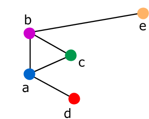
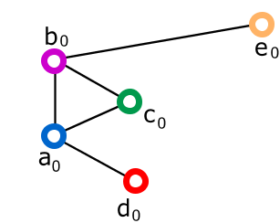
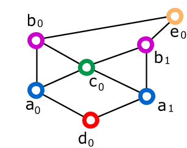
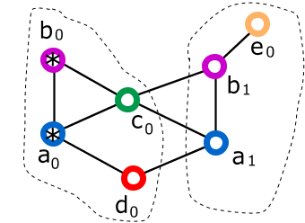
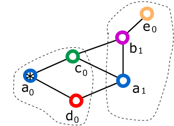

# Modulo Neighborhood - Proof of concept

1.  [Interazione del programma con l'utente](#Interazione_del_programma_con_utente)
1.  [Creazione della identità principale](#Creazione_della_identita_principale)
1.  [Codice id-arco](#Codice_id-arco)
1.  [Archi identità](#Archi_identita)
1.  [Creazione di nuove identità, rimozione di vecchie identità](#Creazione_di_nuove_identita_rimozione_di_vecchie_identita)

Come proof of concept è stato realizzato un programma, **neighborhoodclient**, che si avvale del modulo Neighborhood per:

*   Assegnare *indirizzi di scheda* alle interfacce che gestisce.
*   Individuare e realizzare archi con i nodi vicini.
*   Impostare le rotte verso i diretti vicini.

Si tratta di un programma specifico per un sistema Linux.

Durante l'esecuzione del programma, l'utente può verificare che le rotte verso i diretti vicini vengano correttamente
e tempestivamente realizzate e rimosse (ad esempio se un nodo muore o diventa irragiungibile tramite l'arco).

Il programma consente anche di verificare il modus operandi che è stato individuato
(e descritto nel documento di analisi) per realizzare:

*   La creazione di una nuova *identità*.
*   La creazione di un *arco-identita*.
*   La rimozione di un *arco-identità*.
*   La rimozione di una vecchia *identità*.

Questo programma crea e rimuove anche i network namespace e le pseudo-interfacce da assegnare alle
*identità* che il nodo assume, distinte dalla *principale*.

Il programma fornisce anche una classe che prevede dei metodi remoti come *modulo di identità* e una che
prevede dei metodi remoti come *modulo di nodo*. Tali classi usano il modulo Neighborhood per gestire le
comunicazioni lato client e lato server, L'utente può verificare che un metodo remoto può essere
chiamato da un nodo su un suo diretto vicino. Nel caso del *modulo di identità* può verificare che la giusta
*identità* reagisce sul nodo vicino, ma solo se il corrispettivo *arco-identità* è presente.

Inoltre il programma interattivamente consente di chiedere al modulo Neighborhood le informazioni che ha
raccolto e mostrarle all'utente.

Di seguito descriviamo le operazioni svolte da questo programma. Sarà interessante anche perché alcuni aspetti
analizzati qui saranno ripresi nella realizzazione del demone *ntkd* completo.

## <a name="Interazione_del_programma_con_utente"></a>Interazione del programma con l'utente

Il programma *neighborhoodclient* prevede che l'utente immetta, come argomenti della riga di comando e in modo
interattivo dalla console durante la sua esecuzione, tutti i requisiti del modulo. Anche i parametri che normalmente
sarebbero individuati in modo autonomo dal demone *ntkd* (per esempio l'identificativo delle identità) nel caso
del *neighborhoodclient* sono espressamente indicati dall'utente, questo per rendere più facilmente riproducibili
gli ambienti di test.

I parametri passati all'avvio del programma *neighborhoodclient* sono:

*   first_id
*   max_arcs

I comandi che l'utente può dare interattivamente sulla console del programma *neighborhoodclient* sono:

*   info  
    Sintassi: `info`  
    Mostra le informazioni che il nodo ha.
*   help  
    Sintassi: `help`  
    Mostra un elenco dei comandi.
*   manage-nic  
    Sintassi: `manage-nic <mio-dev>`  
    Inizia a gestire una interfaccia di rete.
*   add-arc  
    Sintassi: `add-arc <id-arco> <mio-id> <suo-id> <suo-mac> <suo-linklocal>`  
    Considerato un arco che il neighborhood ha realizzato, vi aggiunge un arco-identità.
*   change-data-arc  
    Sintassi: `change-data-arc <id-arco> <mio-id> <suo-id> <suo-mac> <suo-linklocal>`  
    Considerato un arco che il neighborhood ha realizzato e un arco-identità che vi è stato già aggiunto,
    modifica i suoi valori di suo-mac e suo-linklocal.
*   prepare-add-id  
    Sintassi: `prepare-add-id <mio-vecchio-id> <mio-nuovo-id>`
*   finish-add-id  
    Sintassi:  
```
        finish-add-id
            [ <id-arco>
                <suo-vecchio-id>
                <suo-nuovo-id>
                <suo-vecchio-id-new-mac>
                <suo-vecchio-id-new-linklocal>] [...] 
```
*   remove-arc  
    Sintassi: `remove-arc <id-arco> <mio-id> <suo-id>`
*   remove-id  
    Sintassi: `remove-id <mio-vecchio-id>`
*   whole-node-unicast  
    Sintassi: `whole-node-unicast <id-arco> -- <argomento>`
*   whole-node-broadcast  
    Sintassi: `whole-node-broadcast <id-arco> [<id-arco> ...] -- <argomento>`
*   identity-aware-unicast  
    Sintassi: `identity-aware-unicast <id-arco> <mio-id> <suo-id> -- <argomento>`
*   identity-aware-broadcast  
    Sintassi: `identity-aware-broadcast <mio-id> <suo-id> [<suo-id> ...] -- <argomento>`

Il significato di comandi e parametri sarà chiarito in seguito.

## <a name="Creazione_della_identita_principale"></a>Creazione della identità principale

La *identità principale* del nodo viene creata automaticamente dal demone *ntkd* all'inizio della sua
attività. Nel caso del programma *neighborhoodclient*, l'utente specifica sulla linea di comando
l'identificativo (un intero) da assegnare a tale prima *identità* del nodo.

## <a name="Codice_id-arco"></a>Codice id-arco

Quando il modulo Neighborhood segnala al programma *neighborhoodclient* che ha realizzato un arco,
questo programma gli assegna un numero identificativo che chiamiamo *id-arco* e lo mostra sulla console
all'utente. Questo numero serve solo all'utente per indicare nei suoi comandi quel particolare arco.
Non ha un suo corrispettivo in nessun concetto applicabile al demone *ntkd*.

## <a name="Archi_identita"></a>Archi identità

Quando un nodo rileva un diretto vicino tramite una sua interfaccia e forma con esso un arco, su quell'arco
non appoggia immediatamente nessun *arco-identità*. Su quell'arco possono da subito passare delle comunicazioni
del *modulo di nodo*.

È l'utilizzatore del modulo Neighborhood, in questo caso il programma *neighborhoodclient* su istruzione
dell'utente, a decidere quali *archi-identità* formare.

Ad esempio, supponiamo che il programma *neighborhoodclient* è stato avviato sul nodo *a* indicando come
identificativo della sua identità principale il numero 123\. Sul nodo *b* è stato avviato indicando come
identificativo della sua identità principale il numero 456\. Dopo un po' il programma *neighborhoodclient* segnala
sulla console del nodo *a* di aver realizzato un arco *id-arco=1* con il nodo *b* (sulla console comparirà
il MAC address della interfaccia di rete end-point dell'arco e l'utente saprà riconoscere il nodo *b*).

A questo punto l'utente in via interattiva sulla console del programma in esecuzione sul nodo *a* chiederà
di formare sull'arco *id-arco=1* un *arco-identità* tra 123 e 456, specificando anche che l'interfaccia di
rete (reale o pseudo) assegnata all'identità 456 del nodo peer ha il MAC address *"XX:XX:...XX"* e l'indirizzo
di scheda *"169.254..."*. Cosa analoga sulla console del nodo *b* che avrà anch'esso indicato la formazione dell'arco.

A questo punto su questo *arco-identità* potranno passare anche delle comunicazioni del *modulo di identità*.

## <a name="Creazione_di_nuove_identita_rimozione_di_vecchie_identita"></a>Creazione di nuove identità, rimozione di vecchie identità

Nel demone *ntkd* quando un nodo migra viene creata una nuova identità. In questo proof of concept simuleremo
le operazioni che il demone *ntkd* dovrà fare in questi scenari.

A fronte di una migrazione, una nuova *identità* del nodo, chiamiamola *a<sub>j</sub>*, viene creata partendo
da una delle sue *identità*, chiamiamola *a<sub>k</sub>*, la quale può essere la *principale* o anche no.
Tutti gli *archi-identità* che partivano dalla *a<sub>k</sub>* vengono duplicati automaticamente sulla *a<sub>j</sub>*.

Inoltre, un *arco-identità* che collegava *a<sub>k</sub>* ad una identità *b<sub>i</sub>* del nodo diretto
vicino *b*, quando viene duplicato sulla *a<sub>j</sub>* la collegherà a *b<sub>i</sub>* solo se *b<sub>i</sub>*
non ha partecipato alla stessa migrazione. Se invece *b<sub>i</sub>* ha partecipato alla stessa migrazione,
allora il nuovo *arco-identità* collegherà *a<sub>j</sub>* a una nuova identità *b<sub>h</sub>* che è stata creata
sul nodo *b* partendo dalla *b<sub>i</sub>*.

In seguito alcuni *archi-identità* verranno rimossi dalla *a<sub>k</sub>*.

Nel programma *neighborhoodclient* questo evento viene simulato quando l'utente ne fa richiesta sulla console.
Vediamo in che modo l'utente che interagisce con il programma *neighborhoodclient* può dare tutte le indicazioni
per simulare questo scenario.

Supponiamo di avere i nodi *a*, *b*, *c*, *d*, *e* sui quali è in esecuzione il programma *neighborhoodclient*.
Questi nodi sono disposti secondo il disegno:



Su ogni nodo viene avviato il programma *neighborhoodclient*, specificando sulla linea di comando l'identificativo
numerico da assegnare alla prima *identità principale*. Indichiamo queste *identità* (e il relativo numero
identificativo) con *a<sub>0</sub>*, *b<sub>0</sub>*, *c<sub>0</sub>*, *d<sub>0</sub>*, *e<sub>0</sub>*.

Dopo un certo tempo, il modulo Neigorhood avrà formato degli archi in base alla topologia rappresentata nel
disegno sopra. Questi li indichiamo con *a-b*, *b-c*, *a-c*, *b-e*, *a-d*.

Poi l'utente interagisce dalla console con il programma *neighborhoodclient* in ogni nodo e lo istruisce
riguardo la creazione degli *archi-identità*:

*   *a<sub>0</sub>-b<sub>0</sub>* si appoggia sull'arco *a-b*.  
    Quindi le istruzioni a tal riguardo sono date sulla console del nodo *a* e su quella del nodo *b* in questo modo:

    *   Sul nodo *a* l'utente dice: crea sull'arco *a-b* un *arco-identità* dalla mia identità *a<sub>0</sub>*
        alla sua *identità* *b<sub>0</sub>*; specifica anche che la *identità b<sub>0</sub>* gestisce questo
        *arco-identità* con l'interfaccia il cui MAC è *XX* e il cui indirizzo link-local è *YY*. Nel dettaglio
        gli argomenti di questo comando sono:

        *   *a-b* - l'identificativo *id-arco* dell'arco.
        *   *a<sub>0</sub>* - il numero identificativo dell'identità di partenza nel nodo *a*.
        *   *b<sub>0</sub>* - il numero identificativo dell'identità di destinazione nel nodo *b*.
        *   *XX* - il MAC address dell'interfaccia gestitsa dall'identità *b<sub>0</sub>* su questo arco.
        *   *YY* - l'indirizzo link-local dell'interfaccia gestitsa dall'identità *b<sub>0</sub>* su questo arco.

    *   Sul nodo *b* l'utente dice: crea sull'arco *b-a* un *arco-identità* dalla mia identità *b<sub>0</sub>*
        alla sua *identità* *a<sub>0</sub>* con il MAC *QQ* e il link-local *WW*.

    In modo analogo sui seguenti *archi-identità*.

*   *b<sub>0</sub>-c<sub>0</sub>* si appoggia sull'arco *b-c*.

*   *a<sub>0</sub>-c<sub>0</sub>* si appoggia sull'arco *a-c*.

*   *b<sub>0</sub>-e<sub>0</sub>* si appoggia sull'arco *b-e*.

*   *a<sub>0</sub>-d<sub>0</sub>* si appoggia sull'arco *a-d*.



Adesso le *identità* *a<sub>0</sub>* e *b<sub>0</sub>* migrano dando luogo alle nuove *identità* *a<sub>1</sub>* e
*b<sub>1</sub>* che diventano le *identità principali* dei nodi *a* e *b*.

Per simulare questo evento, l'utente effettua queste operazioni:

*   Sulla console del nodo *a* chiede di preparare (*prepare-add-id*) la costituzione della identità
    *a<sub>1</sub>* basata sulla precedente *a<sub>0</sub>*.  
    Il nodo fa alcune operazioni e visualizza alcuni risultati. Questi saranno necessari all'utente per
    orchestrare la migrazione di un cluster: infatti tutti i nodi all'interno del cluster che migra dovranno
    conoscere questi dati riferiti agli altri nodi del cluster che sono loro diretti vicini.  
    L'utente fornisce questi argomenti al comando:

    *   *a<sub>0</sub>* - il numero identificativo dell'identità di partenza nel nodo *a*.
    *   *a<sub>1</sub>* - il numero identificativo della nuova identità nel nodo *a*.

    Il nodo *a* mostra a video questi dati:

    *   Per ogni interfaccia reale *r* gestita dal nodo:
        *   *dev* - Il nome dell'interfaccia reale.
        *   *mac* - L'indirizzo MAC dell'interfaccia reale *dev*.
        *   *new_dev* - Il nome della pseudo-interfaccia che usa *dev*.
        *   *new_mac* - L'indirizzo MAC della nuova pseudo-interfaccia *new_dev*.
        *   *new_linklocal* - L'indirizzo link-local che verrà assegnato alla nuova pseudo-interfaccia *new_dev*.

*   Analogamente, sulla console del nodo *b* chiede di preparare la costituzione della identità
    *b<sub>1</sub>* basata sulla precedente *b<sub>0</sub>*.

*   Sulla console del nodo *a* chiede di finalizzare (*finish-add-id*) la costituzione della identità
    *a<sub>1</sub>* basata sulla precedente *a<sub>0</sub>*.  
    Nel fare questa richiesta, specifica inoltre che nella stessa migrazione l'identità *b<sub>0</sub>*
    che si raggiungeva dall'identità *a<sub>0</sub>* tramite l'arco *a-b* ha dato luogo alla nuova identità *b<sub>1</sub>*.  
    Si noti che in questo caso l'identità *b<sub>0</sub>* si raggiungeva dall'identità *a<sub>0</sub>* solo
    tramite l'arco *a-b*. Potevano però anche esserci molti archi che collegavano *a<sub>0</sub>* a
    *b<sub>0</sub>*. Per ognuno di questi archi, il nodo *a* va informato di quali sono i dati (indirizzo
    MAC e link-local) della nuova pseudo-interfaccia di rete che è gestita adesso dall'identità *b<sub>0</sub>*.
    I vecchi dati vanno ora associati alla identità *b<sub>1</sub>*.  
    Queste informazioni vanno replicate per ogni *arco-identità* che congiunge ad una *identità* che ha
    partecipato a questa migrazione.  
    Gli altri *archi-identità*, quelli che congiungono ad *identità* che non hanno partecipato a questa
    migrazione, vanno duplicati esattamente come erano. Quindi a tal riguardo nessuna informazione va passata
    dall'utente sulla console del nodo *a*.  
    Nel dettaglio gli argomenti di questo comando sono:

    *   *a<sub>0</sub>* - il numero identificativo dell'identità di partenza nel nodo *a*.
    *   *a<sub>1</sub>* - il numero identificativo della nuova identità nel nodo *a*.
    *   un set di associazioni, ognuna delle quali è una struttura dati che contiene:
        *   *a-b* - l'identificativo *id-arco* dell'arco.
        *   *b<sub>0</sub>* - il numero identificativo dell'identità di partenza del nodo collegato, che ha migrato con noi.
        *   *b<sub>1</sub>* - il numero identificativo della nuova identità del nodo collegato, che ha migrato con noi.
        *   *new_mac_b<sub>0</sub>* - l'indirizzo MAC della nuova pseudo-interfaccia gestita da *b<sub>0</sub>*.
        *   *new_linklocal_b<sub>0</sub>* - l'indirizzo link-local della nuova pseudo-interfaccia gestita da *b<sub>0</sub>*.

*   Analogamente, sulla console del nodo *b* chiede di finalizzare la costituzione della identità
    *b<sub>1</sub>* basata sulla precedente *b<sub>0</sub>*; specifica inoltre che nella stessa migrazione
    l'identità *a<sub>0</sub>* che si raggiungeva dall'identità *b<sub>0</sub>* tramite l'arco *b-a* ha dato
    luogo alla nuova identità *a<sub>1</sub>* e ha preso in gestione una nuova pseudo-interfaccia con
    *new_mac_a<sub>0</sub>* e *new_linklocal_a<sub>0</sub>*.

*   Sulla console del nodo *c* chiede la modifica (*change-data-arc*) dei valori MAC e linklocal memorizzati
    per l'identità peer dell' *arco-identità* sull'arco *c-a* che collega la identità *c<sub>0</sub>* con *a<sub>0</sub>*.

*   Analogamente, sulla console del nodo *c* chiede la modifica dei valori dell' *arco-identità* sull'arco
    *c-b* che collega la identità *c<sub>0</sub>* con *b<sub>0</sub>*.

*   Analogamente, sulla console del nodo *d* chiede la modifica dei valori dell' *arco-identità* sull'arco
    *d-a* che collega la identità *d<sub>0</sub>* con *a<sub>0</sub>*.

*   Analogamente, sulla console del nodo *e* chiede la modifica dei valori dell' *arco-identità* sull'arco
    *e-b* che collega la identità *e<sub>0</sub>* con *b<sub>0</sub>*.

*   Sulla console del nodo *c* chiede la costituzione (*add-arc*) di un nuovo *arco-identità* sull'arco *c-a*
    che collega la identità *c<sub>0</sub>* con *a<sub>1</sub>*.

*   Analogamente, sulla console del nodo *c* chiede la costituzione di un nuovo *arco-identità* sull'arco
    *c-b* che collega la identità *c<sub>0</sub>* con *b<sub>1</sub>*.

*   Analogamente, sulla console del nodo *d* chiede la costituzione di un nuovo *arco-identità* sull'arco
    *d-a* che collega la identità *d<sub>0</sub>* con *a<sub>1</sub>*.

*   Analogamente, sulla console del nodo *e* chiede la costituzione di un nuovo *arco-identità* sull'arco
    *e-b* che collega la identità *e<sub>0</sub>* con *b<sub>1</sub>*.



In seguito viene rimosso l' *arco-identità* *b<sub>0</sub>*-*e<sub>0</sub>*. Il motivo di questa rimozione
è spiegato nel documento del modulo QSPN, riguarda i cluster di nodi e le *identità di connettività*.

Per simulare questo evento, l'utente effettua queste operazioni:

*   Sulla console del nodo *b* chiede la rimozione (*remove-arc*) dell' *arco-identità* che poggia sull'arco
    *b-e* e collega *b<sub>0</sub>* a *e<sub>0</sub>*. Nel dettaglio gli argomenti di questo comando sono:

    *   *b<sub>0</sub>* - il numero identificativo dell'identità di partenza nel nodo *b*.
    *   *e<sub>0</sub>* - il numero identificativo dell'identità di destinazione nel nodo *e*.
    *   *b-e* - l'identificativo *id-arco* dell'arco.

*   Analogamente, sulla console del nodo *e* chiede la rimozione dell' *arco-identità* che poggia sull'arco
    *e-b* e collega *e<sub>0</sub>* a *b<sub>0</sub>*.

Nel disegno evidenziamo i cluster. Risulta più chiaro che la migrazione delle *identità principali* di *a*
e *b* da un cluster all'altro ha reso necessaria la presenza delle *identità di connettività* di *a* e *b*
nel primo cluster per mantenerlo internamente connesso. Risulta altresì chiaro perché è stato rimosso un
*arco-identità*: perché una *identità di connettività* mantiene collegamenti solo all'interno del cluster che
essa supporta. Evidenziamo anche le *identità di connettività* con un asterisco.



Infine l'identità *b<sub>0</sub>* si accorge di non essere necessaria alla connettività interna del primo
cluster, quindi si auto-distrugge.

Per simulare questo evento, l'utente effettua queste operazioni:

*   Sulla console del nodo *b* chiede la rimozione (*remove-id*) della *identità* *b<sub>0</sub>*.

*   Sulla console del nodo *a* chiede la rimozione dell' *arco-identità* che poggia sull'arco *a-b* e
    collega *a<sub>0</sub>* a *b<sub>0</sub>*. Nel dettaglio gli argomenti di questo comando sono:

    *   *a<sub>0</sub>* - il numero identificativo dell'identità di partenza nel nodo *a*.
    *   *b<sub>0</sub>* - il numero identificativo dell'identità di destinazione nel nodo *b*.
    *   *a-b* - l'identificativo *id-arco* dell'arco.

*   Analogamente, sulla console del nodo *c* chiede la rimozione dell' *arco-identità* che poggia sull'arco
    *c-b* e collega *c<sub>0</sub>* a *b<sub>0</sub>*.


