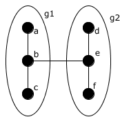
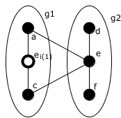
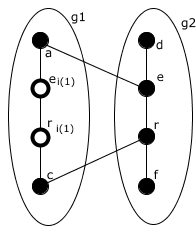

# Modulo QSPN - Routing di pacchetti verso indirizzi IP interni

Con gli esempi riportati in questo documento:

*   Illustriamo l'uso di indirizzi IP *interni* ad un g-nodo.
*   Illustriamo l'uso di policy di routing per l'instradamento di un pacchetto IP ricevuto e da inoltrare.
    In particolare, ci riferiamo alla situazione in cui l'indirizzo IP di destinazione è *interno* ad un g-nodo
    di livello *i* e il nostro nodo appartiene (per via di alcuni indirizzi *di connettività*) a più g-nodi
    distinti di livello *i*. Le policy di routing che permettono un instradamento corretto sono basate sul
    riconoscimento dell'interfaccia di rete (reale o virtuale) su cui il nodo ha ricevuto il pacchetto.

## Indirizzi IP interni ad un g-nodo

Abbiamo detto che l'uso di indirizzi IP *interni* è un accorgimento che mitiga molto il disagio dovuto al cambio
di indirizzo di un intero g-nodo di grandi dimensioni.

### Esempio 1.1

Consideriamo questa porzione di una rete:



Nella rete *G* usiamo una topologia di 3 livelli con gsize=4. Quindi abbiamo 4<sup>3</sup>=64 indirizzi, che
traduciamo in indirizzi IP dal 10.0.0.0 al 10.0.0.63.

Indichiamo gli indirizzi dei singoli nodi con una tupla di 3 elementi, \[p<sub>0</sub>, p<sub>1</sub>,
p<sub>2</sub>], dove p<sub>0</sub> è la posizione del nodo nel g-nodo di livello 1, ..., p<sub>2</sub> è la
posizione del g-nodo di livello 2 nella rete.

Indichiamo i g-nodi di livello 1 con una tupla di 2 elementi, \[p<sub>1</sub>, p<sub>2</sub>].

Indichiamo i g-nodi di livello 2 con una tupla di 1 elemento, \[p<sub>2</sub>].

Indichiamo con la scrittura *g<sub>1</sub>(𝛼)*, *g<sub>2</sub>(𝛼)*, ..., il g-nodo di livello 1, 2, ..., a
cui appartiene il nodo 𝛼.

Abbiamo assegnato ai nodi questi indirizzi:

*   *a* = \[0, 1, 0] = 10.0.0.4
*   *b* = \[1, 1, 0] = 10.0.0.5
*   *c* = \[3, 1, 0] = 10.0.0.7
*   *d* = \[0, 2, 0] = 10.0.0.8
*   *e* = \[1, 2, 0] = 10.0.0.9
*   *f* = \[3, 2, 0] = 10.0.0.11

Le tabelle di routing dei vari nodi sono semplici da dedurre. Ad esempio, se *a* vuole raggiungere *f* sa
che per 10.0.0.8/30 deve usare come gateway *b*. Poi *b* sa che per 10.0.0.8/30 deve usare come gateway *e*.
Poi *e* sa che per 10.0.0.11/32 deve usare come gateway *f*. La destinazione è raggiunta.

Supponiamo ora che il g-nodo *g2* cambi indirizzo e da \[2, 0] diventi \[1, 1]. Ovviamente le comunicazioni
in corso tra *a* e *f* saranno da ripristinare poiché l'indirizzo di *f* è divenuto 10.0.0.23.

Vediamo però cosa succede ad una comunicazione in corso tra *d* e *f*. Anche questa si perde, poiché entrambi
i nodi cambiano il loro indirizzo.

Supponiamo invece di usare degli indirizzi IP *interni* ai g-nodi di livello 1. Questi g-nodi al loro interno
hanno 4 posizioni valide. Diciamo che le traduciamo in indirizzi IP dal 10.0.1.0 al 10.0.1.3, i quali non
interferiscono con il range di indirizzi visto prima.<sup>1</sup>

Quindi abbiamo che gli indirizzi assegnati ai nodi sono:

*   *a* = \[0, 1, 0] = 10.0.0.4 **e** 10.0.1.0 in *g1*
*   *b* = \[1, 1, 0] = 10.0.0.5 **e** 10.0.1.1 in *g1*
*   *c* = \[3, 1, 0] = 10.0.0.7 **e** 10.0.1.3 in *g1*
*   *d* = \[0, 2, 0] = 10.0.0.8 **e** 10.0.1.0 in *g2*
*   *e* = \[1, 2, 0] = 10.0.0.9 **e** 10.0.1.1 in *g2*
*   *f* = \[3, 2, 0] = 10.0.0.11 **e** 10.0.1.3 in *g2*

Le tabelle di routing dei vari nodi hanno di conseguenza maggiori informazioni. Ad esempio, se *d* vuole
raggiungere *f* e usa il suo indirizzo *interno* al g-nodo di livello 1 sa che per 10.0.1.3/32 deve usare come
gateway *e*. Poi *e* sa che per 10.0.1.3/32 deve usare come gateway *f*. La destinazione è raggiunta.

Se ora il g-nodo *g2* cambia indirizzo e da \[2, 0] diventa \[1, 1], le comunicazioni in corso tra *d* e *f*
rimarranno valide e funzionanti poiché l'indirizzo di *f* in *g2* è rimasto 10.0.1.3.

* * *

**Nota 1**: Per una strategia efficiente di individuazione dei range di indirizzi IP *interni* ai g-nodi si veda il documento
[Indirizzi IP](../DemoneNTKD/IndirizziIP.md#mappatura-dello-spazio-di-indirizzi-netsukuku-nello-spazio-di-indirizzi-ip).

## Problema dei nodi virtuali

I nodi virtuali sono previsti per evitare che una migrazione di un nodo provochi lo split (disconnessione) di un
suo g-nodo superiore. La contromisura che evita lo split consiste nel fatto che un singolo nodo appartiene
contemporaneamente a diversi g-nodi di livello 1. All'interno del g-nodo dal quale è uscito, il nodo assume un
indirizzo *virtuale* al livello 0 e *di connettività* ai livelli da 1 a *j*, dove *j* è il livello del g-nodo più
alto dal quale il nodo migrando è uscito.

Ma l'esistenza di nodi virtuali, cioè di singoli nodi che appartengono contemporaneamente a diversi g-nodi di
livello 1, comporta un problema con il routing tramite indirizzi interni.

Consideriamo un nodo *n* che ha, oltre all'indirizzo *definitivo*,  un indirizzo *di connettività* ai livelli
da 1 a *j*. Questo significa che i suoi 2 indirizzi suddetti appartengono a 2 distinti g-nodi di livello 1, a 2
distinti g-nodi di livello 2, ... a 2 distinti g-nodi di livello *j*.

Se *n* riceve un pacchetto da inoltrare ad un indirizzo IP interno al g-nodo di livello 1, questo indirizzo IP da
solo non contiene informazioni sufficienti a identificare la vera destinazione e quindi il percorso da seguire.
Lo stesso accade se *n* riceve un pacchetto da inoltrare ad un indirizzo IP interno al g-nodo di livello 2.
Fino al livello *j*.

Ovviamente la stessa cosa vale in generale per l'esistenza di g-nodi *di connettività* ai livelli da *i* a *j*
(e *virtuali* al livello *i* - 1).

Illustriamo nel dettaglio il problema con un esempio che tratta il caso di uno o più nodi che adottano un indirizzo
*di connettività* al livello 1. Cercheremo poi di esprimere la soluzione trovata in termini generici di nodi che
adottano un indirizzo *di connettività* ai livelli da *i* a *j*.

### Esempio 2.1

Consideriamo questa porzione di una rete:



I nodi reali sono *a*, *c*, *d*, *e*, *f*. I link reali sono *a-e*, *c-e*, *d-e*, *f-e*. Per motivi riguardanti i
vincoli di topologia (che non sono evidenti da questa porzione della rete) diciamo che *a* e *c* devono far parte
dello stesso g-nodo *g1*, mentre il nodo *e* che prima ne faceva parte ha dovuto migrare in *g2*. Per evitare lo
split, *e* è rimasto con un identificativo *virtuale* al livello 0 e *di connettività* al livello 1 dentro *g1*;
il suo indirizzo in *g1* è rappresentato nel disegno come *e<sub>i(1)</sub>*.

Con gli stessi parametri di topologia visti nell'esempio 1.1, possiamo ipotizzare questi indirizzi per i nodi:

*   *a* = \[0, 1, 0] = 10.0.0.4 **e** 10.0.1.0 in *g1*
*   *e<sub>i(1)</sub>* = \[5, 1, 0]
*   *c* = \[3, 1, 0] = 10.0.0.7 **e** 10.0.1.3 in *g1*
*   *d* = \[0, 2, 0] = 10.0.0.8 **e** 10.0.1.0 in *g2*
*   *e* = \[1, 2, 0] = 10.0.0.9 **e** 10.0.1.1 in *g2*
*   *f* = \[3, 2, 0] = 10.0.0.11 **e** 10.0.1.3 in *g2*

Il problema sorge quando si devono impostare le rotte nel nodo *e*.

Ad esempio, se *a* vuole raggiungere *f* sa che per 10.0.0.8/30 deve usare come gateway *e*. Si ricordi infatti
che *e* e *e<sub>i(1)</sub>* sono lo stesso nodo. Poi *e* sa che per 10.0.0.11/32 deve usare come gateway *f*. La
destinazione è raggiunta.

Ma se *a* vuole raggiungere *c* usando il suo indirizzo *interno* in *g1*, cioè 10.0.1.3? Deve usare come gateway *e*.
Mentre se *d* vuole raggiungere *f* usando il suo indirizzo *interno* in *g2*, cioè 10.0.1.3? Deve usare come gateway *e*.

Quindi il nodo *e* dovrebbe avere 2 rotte diverse per raggiungere 10.0.1.3 a seconda se il pacchetto da inoltrargli
è proveniente da *a* o da *d*.

Si noti che il problema non si pone quando l'indirizzo IP a cui il nodo *e* deve inoltrare un pacchetto è *interno*
nel g-nodo di livello 2 o superiore. Infatti entrambi gli indirizzi di *e* (\[5, 1, 0] e \[1, 2, 0]) appartengono
allo stesso g-nodo di livello 2 (\[0]).

Quando il nodo *e* riceve un pacchetto IP nel suo header vede l'indirizzo IP del mittente e quello di destinazione.
Nel frame Ethernet in cui è incapsulato vede l'indirizzo MAC del nodo che lo ha trasmesso e quello della sua
interfaccia che lo ha ricevuto.

Questa situazione potrebbe essere gestita sulla base di questa informazione: il nodo diretto vicino che ha trasmesso
il pacchetto. Ma si capisce che quando la migrazione ha interessato più di un singolo nodo la soluzione diventa
inefficace. Lo vediamo nel seguente esempio.

### Esempio 2.2

Consideriamo questa porzione di una rete:



I nodi *e* ed *r* in questo caso migrando da *g1* a *g2* sono rimasti con un indirizzo *virtuale* al livello 0 e
*di connettività* al livello 1 dentro *g1*.

Con gli stessi parametri di topologia visti nell'esempio 2.1, possiamo ipotizzare questi indirizzi per i nodi:

*   *a* = \[0, 1, 0] = 10.0.0.4 **e** 10.0.1.0 in *g1*
*   *e<sub>i(1)</sub>* = \[5, 1, 0]
*   *r<sub>i(1)</sub>* = \[6, 1, 0]
*   *c* = \[3, 1, 0] = 10.0.0.7 **e** 10.0.1.3 in *g1*
*   *d* = \[0, 2, 0] = 10.0.0.8 **e** 10.0.1.0 in *g2*
*   *e* = \[1, 2, 0] = 10.0.0.9 **e** 10.0.1.1 in *g2*
*   *r* = \[2, 2, 0] = 10.0.0.10 **e** 10.0.1.2 in *g2*
*   *f* = \[3, 2, 0] = 10.0.0.11 **e** 10.0.1.3 in *g2*

Se *a* vuole raggiungere *c* usando il suo indirizzo *interno* in *g1*, cioè 10.0.1.3, deve usare come gateway *e*.
Poi *e* sa che per 10.0.1.3/32 quando il pacchetto proviene da *a* deve usare *r*.

A questo punto il nodo *r* riceve un pacchetto IP. Nel suo header vede l'indirizzo IP del mittente (10.0.1.1) e
quello di destinazione (10.0.1.3). Nel frame Ethernet in cui è incapsulato vede l'indirizzo MAC del nodo che lo ha
trasmesso (*e*) e quello della sua interfaccia che lo ha ricevuto. Il nodo *r* non sa in alcun modo se il pacchetto
proveniva da *a* o da *d*, prima di passare per *e*.

## Soluzione

La soluzione a questo problema appare evidente se si guarda il disegno del grafo. Bisogna fare in modo che il nodo
virtuale *e<sub>i(1)</sub>* sia effettivamente distinto dal nodo *e*. E che il nodo virtuale *r<sub>i(1)</sub>* sia
effettivamente distinto dal nodo *r*. E infine che l'arco virtuale *e<sub>i(1)</sub>-r<sub>i(1)</sub>* sia
effettivamente distinto dall'arco *e-r*. Cioè che risultino avere un indirizzo MAC distinto.

Con maggiore precisione, quando un nodo 𝛼 migra da *g* ad *h* (g-nodi distinti di livello *i* il cui minimo comune
g-nodo è di livello *j* + 1, con *j* ≥ *i*) si assegna nel vecchio g-nodo un indirizzo *di connettività* ai livelli
da *i* a *j*. Sopra tutte le interfacce di rete gestite, il nodo 𝛼 crea una pseudo-interfaccia (a cui associa un
nuovo indirizzo MAC e un nuovo indirizzo IP link-local) per la gestione di tale indirizzo *di connettività* ai
livelli da *i* a *j*.

Il nodo 𝛼 duplica tutti gli archi in *arcs(g)* in altrettanti archi in *arcs(h)*. Poi fa sugli archi in *arcs(g)*
le operazioni che ora illustriamo.

Per un arco che il nodo 𝛼 ha con un nodo 𝛽 che appartiene al suo stesso g-nodo di livello *i* - 1, ora i suoi
estremi sono la pseudo-interfaccia di 𝛼 e la pseudo-interfaccia di 𝛽. Infatti anche il nodo 𝛽 ha fatto la stessa
migrazione.

Per un arco che il nodo 𝛼 ha con un nodo 𝛾 che non appartiene al suo stesso g-nodo di livello *i* - 1, ora il suo
estremo in 𝛼 è la pseudo-interfaccia, mentre non cambia il suo estremo in 𝛾.

Inoltre, dopo che il nuovo indirizzo in *h* ha completato la fase di bootstrap, ogni arco che il nodo 𝛼 ha con un
nodo 𝛿 che non appartiene al suo stesso g-nodo di livello *j*, viene rimosso.

Rivediamo l'esempio. Se *a* vuole raggiungere *c* usando il suo indirizzo *interno* in *g1*, cioè 10.0.1.3, deve
usare come gateway *e<sub>i(1)</sub>*. Poi il nodo *e* sa che per 10.0.1.3/32 quando il pacchetto è stato ricevuto
tramite l'interfaccia *e<sub>i(1)</sub>* deve usare il suo arco virtuale *e<sub>i(1)</sub>-r<sub>i(1)</sub>*. Ora
il nodo *r* sa che per 10.0.1.3/32 quando il pacchetto è stato ricevuto tramite l'interfaccia *r<sub>i(1)</sub>* deve
usare come gateway *c*. La destinazione è raggiunta.

La creazione di una pseudo-interfaccia di rete si può fare in Linux con il modulo *macvlan*. Con i comandi

```
ip link add dev virt0_eth1 link eth1 type macvlan
ip link set dev virt0_eth1 address 02:00:11:22:33:44
```

si crea una nuova interfaccia di rete virtuale di nome "virt0_eth1" che si appoggia all'interfaccia "eth1" ma ha
un suo specifico indirizzo MAC distinto.

E' sufficiente il solo primo comando, che assegna automaticamente un nuovo indirizzo MAC alla nuova scheda. In
questo esempio si è preferito impostare uno specifico indirizzo solo per garantire la ripetibilità dei test
nell'ambiente di prova. Nella scelta di un indirizzo MAC per una pseudo-interfaccia di rete occorre ricordare che:

*   Il secondo bit meno significativo del primo byte deve essere 1. Significa che l'indirizzo non è unico
    globalmente, ma amministrato localmente.
*   Il primo bit meno significativo del primo byte deve essere 0. Significa che è un indirizzo unicast.

Cioè l'indirizzo è nella forma *?x:??:??:??:??:??* dove *x* può essere 2, 6, A, E.

Inoltre il nodo 𝛼 che migra crea un nuovo network namespace temporaneo per la gestione dell'indirizzo
*di connettività*. Con i comandi

```
ip netns add virt0
ip link set dev virt0_eth1 netns virt0
```

si crea un network namespace di nome "virt0" e si sposta in esso la pseudo-interfaccia "virt0_eth1".

In seguito allo spostamento di una interfaccia in un network namespace diverso dal default, i comandi che la
riguardano vanno dati in questa forma (ad esempio per assegnarle un indirizzo):

```
ip netns exec virt0 ip address add 169.254.123.234/32 dev virt0_eth1
```

Infine, si ricordi di correggere queste impostazioni che influenzano il comportamento di un sistema Linux a
fronte di richieste ARP:

```
ip netns exec virt0 sysctl -w net.ipv4.conf.virt0_eth1.arp_ignore=1
ip netns exec virt0 sysctl -w net.ipv4.conf.virt0_eth1.arp_announce=2
```

Al termine, per rimuovere una pseudo-interfaccia e poi rimuovere un network namespace si usano questi comandi:

```
ip netns exec virt0 ip link delete virt0_eth1 type macvlan
ip netns del virt0
```

### Verifica

Verifichiamo con un testbed. Virtualiziamo i nodi *a*, *c*, *d*, *e*, *r*, *f*. Ognuno con la sua interfaccia
di rete "eth1" vede i nodi secondo il grafo riportato sopra.

Diamo i comandi:

**nodo a**
```
ip link set eth1 up
ip address add 169.254.168.234 dev eth1
ip route add 169.254.135.100 dev eth1 src 169.254.168.234
ip route add 169.254.229.140 dev eth1 src 169.254.168.234
ip address add 10.0.0.4 dev eth1
ip address add 10.0.1.0 dev eth1
ip route add 10.0.0.8/30 via 169.254.135.100 dev eth1 src 10.0.0.4
ip route add 10.0.0.7/32 via 169.254.229.140 dev eth1 src 10.0.0.4
ip route add 10.0.1.3/32 via 169.254.229.140 dev eth1 src 10.0.1.0
```

**nodo c**
```
ip link set eth1 up
ip address add 169.254.54.241 dev eth1
ip route add 169.254.73.227 dev eth1 src 169.254.54.241
ip route add 169.254.81.230 dev eth1 src 169.254.54.241
ip address add 10.0.0.7 dev eth1
ip address add 10.0.1.3 dev eth1
ip route add 10.0.0.8/30 via 169.254.73.227 dev eth1 src 10.0.0.7
ip route add 10.0.0.4/32 via 169.254.81.230 dev eth1 src 10.0.0.7
ip route add 10.0.1.0/32 via 169.254.81.230 dev eth1 src 10.0.1.3
```

**nodo d**
```
ip link set eth1 up
ip address add 169.254.167.141 dev eth1
ip route add 169.254.135.100 dev eth1 src 169.254.167.141
ip address add 10.0.0.8 dev eth1
ip address add 10.0.1.0 dev eth1
ip route add 10.0.0.4/30 via 169.254.135.100 dev eth1 src 10.0.0.8
ip route add 10.0.0.9/32 via 169.254.135.100 dev eth1 src 10.0.0.8
ip route add 10.0.0.10/32 via 169.254.135.100 dev eth1 src 10.0.0.8
ip route add 10.0.0.11/32 via 169.254.135.100 dev eth1 src 10.0.0.8
ip route add 10.0.1.1/32 via 169.254.135.100 dev eth1 src 10.0.1.0
ip route add 10.0.1.2/32 via 169.254.135.100 dev eth1 src 10.0.1.0
ip route add 10.0.1.3/32 via 169.254.135.100 dev eth1 src 10.0.1.0
```

**nodo e**
```
ip link set eth1 up
ip address add 169.254.135.100 dev eth1
ip route add 169.254.167.141 dev eth1 src 169.254.135.100
ip route add 169.254.73.227 dev eth1 src 169.254.135.100
ip route add 169.254.168.234 dev eth1 src 169.254.135.100
ip link add name virt0_eth1 link eth1 type macvlan
ip link set dev virt0_eth1 address FE:3E:97:D8:09:95
sysctl -w net.ipv4.conf.virt0_eth1.arp_ignore=1
sysctl -w net.ipv4.conf.virt0_eth1.arp_announce=2
ip netns add virt0
ip link set dev virt0_eth1 netns virt0
ip netns exec virt0 ip link set virt0_eth1 up
ip netns exec virt0 ip address add 169.254.229.140 dev virt0_eth1
ip netns exec virt0 ip route add 169.254.168.234 dev virt0_eth1 src 169.254.229.140
ip netns exec virt0 ip route add 169.254.81.230 dev virt0_eth1 src 169.254.229.140
ip address add 10.0.0.9 dev eth1
ip address add 10.0.1.1 dev eth1
ip route add 10.0.0.4/30 via 169.254.168.234 dev eth1 src 10.0.0.9
ip route add 10.0.0.8/32 via 169.254.167.141 dev eth1 src 10.0.0.9
ip route add 10.0.0.10/32 via 169.254.73.227 dev eth1 src 10.0.0.9
ip route add 10.0.0.11/32 via 169.254.73.227 dev eth1 src 10.0.0.9
ip route add 10.0.1.0/32 via 169.254.167.141 dev eth1 src 10.0.1.1
ip route add 10.0.1.2/32 via 169.254.73.227 dev eth1 src 10.0.1.1
ip route add 10.0.1.3/32 via 169.254.73.227 dev eth1 src 10.0.1.1
ip netns exec virt0 ip route add 10.0.0.4/32 via 169.254.168.234 dev virt0_eth1
ip netns exec virt0 ip route add 10.0.1.0/32 via 169.254.168.234 dev virt0_eth1
ip netns exec virt0 ip route add 10.0.0.7/32 via 169.254.81.230 dev virt0_eth1
ip netns exec virt0 ip route add 10.0.1.3/32 via 169.254.81.230 dev virt0_eth1
```

**nodo r**
```
ip link set eth1 up
ip address add 169.254.73.227 dev eth1
ip route add 169.254.135.100 dev eth1 src 169.254.73.227
ip route add 169.254.122.95 dev eth1 src 169.254.73.227
ip route add 169.254.54.241 dev eth1 src 169.254.73.227
ip link add name virt0_eth1 link eth1 type macvlan
ip link set dev virt0_eth1 address EA:32:A3:C5:0D:CD
sysctl -w net.ipv4.conf.virt0_eth1.arp_ignore=1
sysctl -w net.ipv4.conf.virt0_eth1.arp_announce=2
ip netns add virt0
ip link set dev virt0_eth1 netns virt0
ip netns exec virt0 ip link set virt0_eth1 up
ip netns exec virt0 ip address add 169.254.81.230 dev virt0_eth1
ip netns exec virt0 ip route add 169.254.54.241 dev virt0_eth1 src 169.254.81.230
ip netns exec virt0 ip route add 169.254.229.140 dev virt0_eth1 src 169.254.81.230
ip address add 10.0.0.10 dev eth1
ip address add 10.0.1.2 dev eth1
ip route add 10.0.0.4/30 via 169.254.54.241 dev eth1 src 10.0.0.10
ip route add 10.0.0.8/32 via 169.254.135.100 dev eth1 src 10.0.0.10
ip route add 10.0.0.9/32 via 169.254.135.100 dev eth1 src 10.0.0.10
ip route add 10.0.0.11/32 via 169.254.122.95 dev eth1 src 10.0.0.10
ip route add 10.0.1.0/32 via 169.254.135.100 dev eth1 src 10.0.1.2
ip route add 10.0.1.1/32 via 169.254.135.100 dev eth1 src 10.0.1.2
ip route add 10.0.1.3/32 via 169.254.122.95 dev eth1 src 10.0.1.2
ip netns exec virt0 ip route add 10.0.0.4/32 via 169.254.229.140 dev virt0_eth1
ip netns exec virt0 ip route add 10.0.1.0/32 via 169.254.229.140 dev virt0_eth1
ip netns exec virt0 ip route add 10.0.0.7/32 via 169.254.54.241 dev virt0_eth1
ip netns exec virt0 ip route add 10.0.1.3/32 via 169.254.54.241 dev virt0_eth1
```

**nodo f**
```
ip link set eth1 up
ip address add 169.254.122.95 dev eth1
ip route add 169.254.73.227 dev eth1 src 169.254.122.95
ip address add 10.0.0.11 dev eth1
ip address add 10.0.1.3 dev eth1
ip route add 10.0.0.4/30 via 169.254.73.227 dev eth1 src 10.0.0.11
ip route add 10.0.0.8/32 via 169.254.73.227 dev eth1 src 10.0.0.11
ip route add 10.0.0.9/32 via 169.254.73.227 dev eth1 src 10.0.0.11
ip route add 10.0.0.10/32 via 169.254.73.227 dev eth1 src 10.0.0.11
ip route add 10.0.1.0/32 via 169.254.73.227 dev eth1 src 10.0.1.3
ip route add 10.0.1.1/32 via 169.254.73.227 dev eth1 src 10.0.1.3
ip route add 10.0.1.2/32 via 169.254.73.227 dev eth1 src 10.0.1.3
```

Dopo aver dato questi comandi, le cose da verificare accedendo ai singoli nodi virtuali sono:

*   Che ogni nodo possa raggiungere tutti gli altri nodi con il loro indirizzo globale.
*   Che il nodo *a* raggiunga il nodo *c* tramite l'indirizzo 10.0.1.3.
*   Che il nodo *d* raggiunga il nodo *f* tramite l'indirizzo 10.0.1.3.
*   Che il nodo *e* raggiunga il nodo *f* tramite l'indirizzo 10.0.1.3.
*   Che il nodo *r* raggiunga il nodo *f* tramite l'indirizzo 10.0.1.3.

Se il g-nodo *g1* migra, una connessione TCP tra *a* e *c* deve continuare a funzionare. Si realizzi una
connessione TCP dal nodo *a* verso l'indirizzo interno 10.0.1.3. Si diano i seguenti comandi ai nodi
*a* e *c* (che realizzano la migrazione del g-nodo *g1*) uno alla volta, verificando che la connessione
TCP suddetta non si interrompa mai.

**nodo a**
```
ip route change 10.0.0.8/30 via 169.254.135.100 dev eth1
ip route del 10.0.0.7/32 via 169.254.229.140 dev eth1 src 10.0.0.4
ip address del 10.0.0.4/32 dev eth1
```

**nodo c**
```
ip route change 10.0.0.8/30 via 169.254.73.227 dev eth1
ip route del 10.0.0.4/32 via 169.254.81.230 dev eth1 src 10.0.0.7
ip address del 10.0.0.7/32 dev eth1
```

