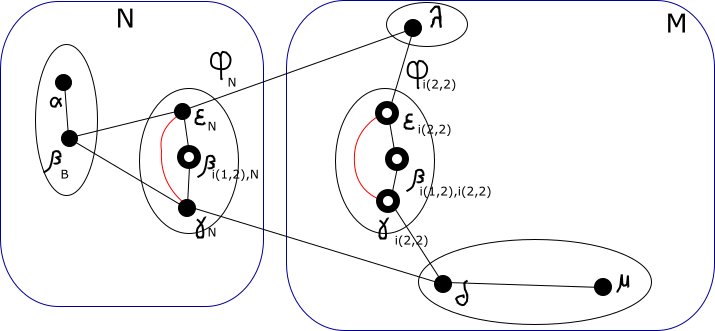
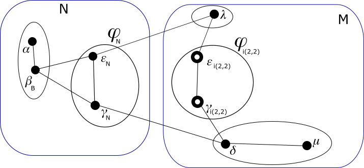

# Modulo QSPN - Esempio di uso degli indirizzi virtuali

## Passo 11

Ora analiziamo alcune delle dinamiche nella rete che possono portare alla rimozione di identità *di connettività* sui sistemi.

Supponiamo che a causa di variazioni nelle condizioni atmosferiche, ora il sistema 𝜀 e il sistema 𝛾 sono a distanza di
rilevamento con la loro interfaccia "eth1". Siccome entrambi hanno due identità devono valutare quali archi vanno formati:

*   L'arco fra le due identità *definitive* si forma sempre. Quindi abbiamo 𝜀<sub>N</sub>-𝛾<sub>N</sub>.
*   L'identità 𝜀<sub>i(2,2)</sub> è *di connettività* al livello 2 e ha indirizzo 1·2·1. L'identità 𝛾<sub>N</sub> ha
    indirizzo 0·0·0 e quindi non appartiene a 1·. Quindi **non** abbiamo 𝜀<sub>i(2,2)</sub>-𝛾<sub>N</sub>.
*   Analogamente, l'identità 𝛾<sub>i(2,2)</sub> è *di connettività* al livello 2 e ha indirizzo 1·2·0. L'identità 𝜀<sub>N</sub>
    ha indirizzo 0·0·1 e quindi non appartiene a 1·. Quindi **non** abbiamo 𝜀<sub>N</sub>-𝛾<sub>i(2,2)</sub>.
*   L'identità 𝜀<sub>i(2,2)</sub> e l'identità 𝛾<sub>i(2,2)</sub> appartengono entrambe a 1·. Quindi
    abbiamo 𝜀<sub>i(2,2)</sub>-𝛾<sub>i(2,2)</sub>.



Diamo questi comandi ai sistemi:

**sistema 𝛾**
```
ip route add 169.254.163.36 dev eth1 src 169.254.94.223
ip netns exec ntkv1 ip route add 169.254.241.153 dev ntkv1_eth1 src 169.254.24.198
```
**sistema 𝜀**
```
ip route add 169.254.94.223 dev eth1 src 169.254.163.36
ip netns exec ntkv1 ip route add 169.254.24.198 dev ntkv1_eth1 src 169.254.241.153
```

La presenza di un nuovo arco su ciascuna delle 4 identità coinvolte scatena una serie di trasmissioni di ETP,
al termine delle quali abbiamo queste nuove conoscenze:

*   Il nodo 𝛾<sub>N</sub> conosce un nuovo percorso per 0·0·1 costituito dall'arco 𝛾<sub>N</sub>-𝜀<sub>N</sub>.
*   Il nodo 𝜀<sub>N</sub> conosce un nuovo percorso per 0·0·0 costituito dall'arco 𝜀<sub>N</sub>-𝛾<sub>N</sub>.
*   Il nodo 𝛽<sub>i(1,2),N</sub> conosce un nuovo percorso per 0·0·0 costituito dagli
    archi 𝛽<sub>i(1,2),N</sub>-𝜀<sub>N</sub>-𝛾<sub>N</sub> e un nuovo percorso per 0·0·1 costituito dagli
    archi 𝛽<sub>i(1,2),N</sub>-𝛾<sub>N</sub>-𝜀<sub>N</sub>.
*   Il nodo 𝛾<sub>i(2,2)</sub> conosce un nuovo percorso per 1·2·1 costituito dall'arco 𝛾<sub>i(2,2)</sub>-𝜀<sub>i(2,2)</sub>.
*   Il nodo 𝜀<sub>i(2,2)</sub> conosce un nuovo percorso per 1·2·0 costituito dall'arco 𝜀<sub>i(2,2)</sub>-𝛾<sub>i(2,2)</sub>.
*   Il nodo 𝛽<sub>i(1,2),i(2,2)</sub> conosce un nuovo percorso per 1·2·0 costituito dagli
    archi 𝛽<sub>i(1,2),i(2,2)</sub>-𝜀<sub>i(2,2)</sub>-𝛾<sub>i(2,2)</sub> e un nuovo percorso per 1·2·1 costituito
    dagli archi 𝛽<sub>i(1,2),i(2,2)</sub>-𝛾<sub>i(2,2)</sub>-𝜀<sub>i(2,2)</sub>.

Tralasciamo di descrivere i comandi che sui vari nodi queste nuove conoscenze potrebbero scatenare o
meno (sulla base dei costi dei vari archi). Quello che ci preme analizzare è la possibilità
di rimuovere alcune identità *di connettività*.

Ora il nodo 𝛽<sub>i(1,2),i(2,2)</sub> si domanda se la rimozione del suo indirizzo 1·2·2 che è
*di connettività* ai livelli da 1 a 2, provoca lo split del g-nodo 1·2· o del g-nodo 1·. Applichiamo la regola
generale esposta nel documento di [analisi](../AnalisiFunzionale.md#ImplementazioneVerificaRimozione)
con *i* = 0 e *j* = 2, dove *i* è il livello del g-nodo che si dovrebbe rimuovere, il quale è *di connettività* ai
livelli da *i* + 1 a *j*.

Per prima cosa si cerca il livello più piccolo *k*, partendo da *i* + 1, in cui il g-nodo
*g<sub>k-1</sub>(𝛽<sub>i(1,2),i(2,2)</sub>)* ha almeno un vicino in *g<sub>k</sub>(𝛽<sub>i(1,2),i(2,2)</sub>)*.
Nel nostro caso è 1, in quanto 1·2·2 (l'equivalente di *g<sub>k-1</sub>(𝛽<sub>i(1,2),i(2,2)</sub>)*) ha i
vicini 1·2·1 e 1·2·0 in 1·2· (l'equivalente di *g<sub>k</sub>(𝛽<sub>i(1,2),i(2,2)</sub>)*).

Questo è l'insieme dei g-nodi di livello da 0 a 1 che 𝛽<sub>i(1,2),i(2,2)</sub> vede nella sua
mappa: {1·2·0, 1·2·1, 1·1·, 1·0·}.

Questo è l'insieme dei g-nodi di livello da 0 che 𝛽<sub>i(1,2),i(2,2)</sub> vede nella sua mappa come
diretti vicini di 1·2·2: {1·2·0, 1·2·1}.

Per ogni elemento *x* del primo set, per ogni elemento *y* del secondo set, se *x* ≠ *y*, il nodo 𝛽<sub>i(1,2),i(2,2)</sub> è
a conoscenza di un percorso per *x* che passa per *y*. Quindi 𝛽<sub>i(1,2),i(2,2)</sub> sa che è possibile rimuovere
l'indirizzo *di connettività* 1·2·2.

In modo del tutto simile il nodo 𝛽<sub>i(1,2),N</sub> scopre che è possibile rimuovere l'indirizzo *di connettività* 0·2·2.



Diamo questi comandi ai sistemi:

**sistema 𝛽**
```
# rimuove 𝛽i12,N
ip netns exec ntkv0 ip link delete ntkv0_eth1 type macvlan
ip netns del ntkv0
# rimuove 𝛽i12,i22
ip netns exec ntkv1 ip link delete ntkv1_eth1 type macvlan
ip netns del ntkv1
```
**sistema 𝛾**
```
# come 𝛾N
ip route change 10.0.0.1/32 via 169.254.163.36 dev eth1 src 10.0.0.0
ip route change 10.0.1.1/32 via 169.254.163.36 dev eth1 src 10.0.1.0
ip route change 10.0.2.1/32 via 169.254.163.36 dev eth1 src 10.0.2.0
ip route del 169.254.27.218 dev eth1 src 169.254.94.223
# come 𝛾i22
ip netns exec ntkv1 ip route change 10.0.0.6/31 via 169.254.241.153 dev ntkv1_eth1
ip netns exec ntkv1 ip route change 10.0.1.1/32 via 169.254.241.153 dev ntkv1_eth1 src 10.0.1.0
ip netns exec ntkv1 ip route change 10.0.2.2/31 via 169.254.241.153 dev ntkv1_eth1
ip netns exec ntkv1 ip route del 169.254.42.4 dev ntkv1_eth1 src 169.254.24.198
```
**sistema 𝜀**
```
# come 𝜀N
ip route change 10.0.0.0/32 via 169.254.94.223 dev eth1 src 10.0.0.1
ip route change 10.0.1.0/32 via 169.254.94.223 dev eth1 src 10.0.1.1
ip route change 10.0.2.0/32 via 169.254.94.223 dev eth1 src 10.0.2.1
ip route del 169.254.27.218 dev eth1 src 169.254.163.36
# come 𝜀i22
ip netns exec ntkv1 ip route change 10.0.0.0/30 via 169.254.24.198 dev ntkv1_eth1
ip netns exec ntkv1 ip route change 10.0.0.4/31 via 169.254.24.198 dev ntkv1_eth1
ip netns exec ntkv1 ip route change 10.0.1.0/32 via 169.254.24.198 dev ntkv1_eth1 src 10.0.1.1
ip netns exec ntkv1 ip route change 10.0.2.0/31 via 169.254.24.198 dev ntkv1_eth1
ip netns exec ntkv1 ip route del 169.254.42.4 dev ntkv1_eth1 src 169.254.241.153
```

Possiamo infine verificare che tutti i nodi raggiungono correttamente tutti gli indirizzi IP globali e gli
indirizzi IP *interni* ai loro g-nodi di livello 1 e 2.

