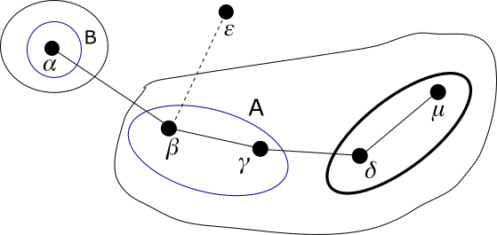
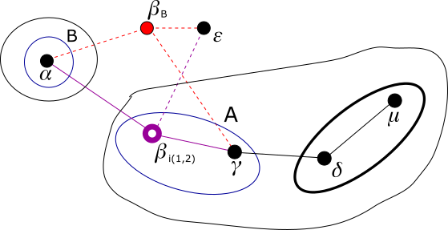

# Modulo QSPN - Esempio di uso degli indirizzi virtuali

## Passo 3

In questo passo simuliamo l'ingresso di un nuovo sistema che forza la migrazione di 𝛽 in g<sub>1</sub>(𝛼), che è non saturo.

Ora nella rete si aggiunge il sistema 𝜀 collegato solo al sistema 𝛽. Esiste l'arco 𝛽-𝜀, ma tale arco non è ancora comunicato
al modulo QSPN in quanto il sistema 𝜀 non fa ancora parte della rete.



Il nuovo sistema si assegna questo indirizzo link-local sull'interfaccia "eth1":

*   *IP(𝜀,eth1)* = 169.254.163.36

Si aggiunge questo arco all'elenco:

*   𝛽-𝜀

Diamo questi comandi ai sistemi:

**sistema 𝛽**
```
ip route add 169.254.163.36 dev eth1 src 169.254.96.141
```
**sistema 𝜀**
```
ip link set eth1 up
ip address add 169.254.163.36 dev eth1
ip route add 169.254.96.141 dev eth1 src 169.254.163.36
```

Al livello più alto la rete è satura, non si può costituire un nuovo g-nodo di livello 2. Il sistema 𝜀 può fare
ingresso solo in g<sub>2</sub>(𝛽) poiché il suo unico vicino è 𝛽. Ma questo è saturo. Anche g<sub>1</sub>(𝛽) è
saturo. Supponiamo che decida di entrare in g<sub>1</sub>(𝛽) = 1·1·. Come soluzione si sceglie di far migrare 𝛽
in g<sub>1</sub>(𝛼) = 0·1·, ma che 𝛽 resti come virtuale in 1·1·.

I due g-nodi interessati dalla migrazione di 𝛽 sono stati evidenziati nel disegno e contrassegnati con le lettere *A* e *B*.

Si noti che il livello più alto in cui i due g-nodi *A* e *B* differiscono è 2.

Il sistema 𝛽, per ognuna delle interfacce di rete gestite, costruisce una pseudo-interfaccia (nel nostro caso su
"eth1" costruiamo "ntkv0_eth1") e su essa si assegna un nuovo indirizzo link-local. Inoltre crea un nuovo network
namespace (nel nostro caso "ntkv0").

*   *IP(𝛽,ntkv0_eth1)* = 169.254.27.218

Diamo questi comandi:

**sistema 𝛽**
```
ip link add dev ntkv0_eth1 link eth1 type macvlan
ip netns add ntkv0
ip link set dev ntkv0_eth1 netns ntkv0
ip netns exec ntkv0 ip link set dev ntkv0_eth1 address E6:2D:52:EE:AF:D1
ip netns exec ntkv0 sysctl -w net.ipv4.conf.ntkv0_eth1.arp_ignore=1
ip netns exec ntkv0 sysctl -w net.ipv4.conf.ntkv0_eth1.arp_announce=2
ip netns exec ntkv0 ip link set ntkv0_eth1 up
ip netns exec ntkv0 ip address add 169.254.27.218 dev ntkv0_eth1
```

Il sistema 𝛽 crea una sua nuova identità, un nodo completamente nuovo, che si assegna a caso un nuovo identificativo,
chiamiamolo 𝛽<sub>B</sub>. Questa userà l'interfaccia di rete e il network namespace con cui il sistema gestiva il suo
precedente indirizzo. Nel nostro caso, l'interfaccia "eth1" nel network namespace default.

La vecchia identità di 𝛽 ora gestirà un indirizzo *di connettività* ai livelli da 1 a 2, che è *virtuale* al
livello 0. Per indicare ciò, da ora in poi la chiamiamo 𝛽<sub>i(1,2)</sub> e la disegnamo come un cerchio vuoto.
Questa userà la pseudo-interfaccia di rete creata adesso nel relativo network namespace.

Il sistema 𝛽 per tutti i suoi archi, cioè 𝛽-𝛾 e 𝛽-𝛼 e 𝛽-𝜀, crea un duplicato, cioè 𝛽<sub>B</sub>-𝛾 e 𝛽<sub>B</sub>-𝛼 e
𝛽<sub>B</sub>-𝜀. Il sistema 𝛽 comunica questa duplicazione ai nodi 𝛾 e 𝛼 e 𝜀, indicando anche la sua nuova identità e
i dati della sua nuova pseudo-interfaccia. Così i nodi 𝛾 e 𝛼 e 𝜀 ora sanno che:

*   I loro archi con 𝛽 (che ora nel grafo è indicato come 𝛽<sub>i(1,2)</sub>) hanno al loro estremo una interfaccia
    di rete che ha come indirizzo IP link-local il 169.254.27.218 e come indirizzo MAC E6:2D:52:EE:AF:D1.
*   I nuovi archi con 𝛽<sub>B</sub> hanno al loro estremo una interfaccia di rete che ha come indirizzo IP link-local
    e come indirizzo MAC quelli che prima erano di 𝛽.
*   Il monitoraggio dell'arco va ora fatto solo sull'arco con 𝛽<sub>B</sub>. I risultati delle misurazioni si
    applicano anche all'arco con 𝛽<sub>i(1,2)</sub>.
*   Le comunicazioni del demone *ntkd* con il vicino 𝛽<sub>i(1,2)</sub> vanno anche esse fatte per il tramite
    dell'arco con 𝛽<sub>B</sub>, utilizzando l'identificativo di 𝛽<sub>i(1,2)</sub> perché il sistema 𝛽 distingua
    l'identità a cui ogni comunicazione è indirizzata. Questo passaggio è importante: infatti pur essendoci ora
    in 𝛽 due distinti network namespace, il demone *ntkd* è unico ed è in esecuzione sul network namespace originale
    gestito da 𝛽<sub>B</sub>.



Nel disegno abbiamo evidenziato in rosso gli elementi nuovi e in violetto quelli modificati. 𝛽<sub>B</sub> è la
nuova identità di 𝛽, anche se essa gestisce ora il network namespace default con i vecchi indirizzi IP link-local
e indirizzi MAC. I suoi archi sono quelli risultati dalla duplicazione. 𝛽<sub>i(1,2)</sub> è la vecchia identità
di 𝛽, anche se essa gestisce ora il nuovo network namespace temporaneo con i nuovi indirizzi IP link-local e
indirizzi MAC. I suoi archi sono quelli che esistevano prima, ma con gli indirizzi IP link-local e MAC modificati.

I nodi 𝛾 e 𝛼, siccome i loro vecchi archi hanno cambiato l'indirizzo IP link-local al loro estremo, oltre ad
aggiungere la rotta con il nuovo indirizzo IP link-local, cambiano le rotte che avevano memorizzato in precedenza
e che usavano 𝛽 come gateway.

Diamo questi comandi ai sistemi:

**sistema 𝛽**
```
ip netns exec ntkv0 ip route add 169.254.69.30 dev ntkv0_eth1 src 169.254.27.218
ip netns exec ntkv0 ip route add 169.254.94.223 dev ntkv0_eth1 src 169.254.27.218
ip netns exec ntkv0 ip route add 169.254.163.36 dev ntkv0_eth1 src 169.254.27.218
ip netns exec ntkv0 ip route add unreachable 10.0.0.0/29
ip netns exec ntkv0 ip route add unreachable 10.0.2.0/30
ip netns exec ntkv0 ip route add unreachable 10.0.1.0/31
```
**sistema 𝛼**
```
ip route add 169.254.27.218 dev eth1 src 169.254.69.30
ip route change 10.0.0.4/30 src 10.0.0.2 via 169.254.27.218 dev eth1
```
**sistema 𝛾**
```
ip route add 169.254.27.218 dev eth1 src 169.254.94.223
ip route change 10.0.0.0/30 src 10.0.0.6 via 169.254.27.218 dev eth1
ip route change 10.0.0.7/32 src 10.0.0.6 via 169.254.27.218 dev eth1
ip route change 10.0.2.3/32 src 10.0.2.2 via 169.254.27.218 dev eth1
ip route change 10.0.1.1/32 src 10.0.1.0 via 169.254.27.218 dev eth1
```
**sistema 𝜀**
```
ip route add 169.254.27.218 dev eth1 src 169.254.163.36
```

Il sistema 𝛽, o meglio la sua identità 𝛽<sub>i(1,2)</sub>, trasforma il suo precedente indirizzo *reale*
*definitivo* 1·1·1, in un indirizzo *di connettività* ai livelli da 1 a 2, cambiando il suo identificativo
al livello 0 nel primo identificativo *virtuale* libero nel g-nodo di livello 1 1·1·, cioè 2. Quindi
diventa 1·1·2, che è *virtuale* al livello 0.

Questo è a tutti gli effetti lo stesso nodo di prima. Ad esso si associa la mappa dei percorsi finora
appresi da 𝛽 e il set di archi e il fingerprint che aveva prima. Ma le informazioni di routing ad esso
associate (i suoi indirizzi e le sue rotte) sono ora di pertinenza del network namespace ntkv0.

Siccome l'indirizzo *reale* viene rimosso e il nodo detiene ora un indirizzo *virtuale* a livello 0, dobbiamo
rimuovere l'indirizzo nella classe 10.0.0.0/24 dal nodo. Siccome adottiamo anche gli indirizzi *interni* ai
g-nodi, dobbiamo rimuovere anche gli indirizzi in 10.0.1.0/24 e 10.0.2.0/24.

Vediamo in generale le operazioni da fare quando l'indirizzo *definitivo* *reale* diventa *di connettività* ai
livelli da *i* a *j* e quindi *virtuale* al livello *i* - 1.

*   Vengono copiati nel network namespace ntkv0 gli indirizzi interni ai propri g-nodi di livello minore di *i*.  
    **TODO:** Questo passo in realtà è superfluo e non è previsto che il demone *ntkd* lo faccia. Infatti si consideri
    che il livello *i* - 1 è quello del g-nodo *g* che migra. Un pacchetto IP che abbia per destinazione un
    indirizzo IP interno ad un g-nodo di livello minore di *i* e che possa raggiungere una pseudo-interfaccia
    gestita in ntkv0 deve essere per forza stato generato da un nodo in *g*. Ma un qualsiasi nodo all'interno di *g*
    è anch'esso migrato, quindi non gestisce il network namespace default del suo sistema. Perciò è impossibile che
    trasmetta un generico pacchetto IP.
*   Le rotte verso g-nodi di livello *k* (quindi contenuti nel nostro g-nodo di livello *k* + 1), con *k* < *i* - 1:
    *   Quelle espresse con indirizzi *interni* al g-nodo di livello *k* + 1 o superiore fino al livello *i* - 1,
        vanno mantenute nel network namespace vecchio e copiate nel network namespace ntkv0. Inoltre, essendo nel
        network namespace ntkv0, se usano come gateway un nodo nel g-nodo che ha migrato, devono usare il nuovo
        indirizzo IP link-local del gateway.
    *   Quelle espresse con indirizzi globali o con indirizzi *interni* ai livelli superiori, vanno rimosse dal
        network namespace vecchio.
*   Le rotte verso g-nodi di livello *k* (quindi contenuti nel nostro g-nodo di livello *k* + 1), con *k* ≥ *i* - 1,
    sia quelle espresse con indirizzi globali che quelle espresse con indirizzi *interni* ai vari livelli, vanno
    spostate dal network namespace vecchio nel network namespace ntkv0, ma senza avere un source preferito. Inoltre,
    essendo nel network namespace ntkv0, se usano come gateway un nodo nel g-nodo che ha migrato, devono usare il
    nuovo indirizzo IP link-local del gateway.
*   Vengono rimossi l'indirizzo globale e gli indirizzi interni ai propri g-nodi di livello maggiore o uguale a *i*
    dal network namespace vecchio.

Quindi diamo questi comandi:

**sistema 𝛽**
```
ip netns exec ntkv0 ip route add 10.0.0.0/30 via 169.254.69.30 dev ntkv0_eth1
ip route del 10.0.0.0/30 via 169.254.69.30 dev eth1 src 10.0.0.7
ip netns exec ntkv0 ip route add 10.0.0.4/31 via 169.254.94.223 dev ntkv0_eth1
ip route del 10.0.0.4/31 via 169.254.94.223 dev eth1 src 10.0.0.7
ip netns exec ntkv0 ip route add 10.0.0.6/32 via 169.254.94.223 dev ntkv0_eth1
ip route del 10.0.0.6/32 via 169.254.94.223 dev eth1 src 10.0.0.7
ip netns exec ntkv0 ip route add 10.0.2.0/31 via 169.254.94.223 dev ntkv0_eth1
ip route del 10.0.2.0/31 via 169.254.94.223 dev eth1 src 10.0.2.3
ip netns exec ntkv0 ip route add 10.0.2.2/32 via 169.254.94.223 dev ntkv0_eth1
ip route del 10.0.2.2/32 via 169.254.94.223 dev eth1 src 10.0.2.3
ip netns exec ntkv0 ip route add 10.0.1.0/32 via 169.254.94.223 dev ntkv0_eth1
ip route del 10.0.1.0/32 via 169.254.94.223 dev eth1 src 10.0.1.1
ip address del 10.0.0.7/32 dev eth1
ip address del 10.0.2.3/32 dev eth1
ip address del 10.0.1.1/32 dev eth1
```

Il nodo 𝛽<sub>i(1,2)</sub> comunica via ETP ai suoi vicini 𝛼 e 𝛾 che non è più possibile raggiungere tramite lui
l'indirizzo 1·1·1; e che ora è possibile raggiungere tramite lui l'indirizzo 1·1·2.

Questo ETP viene recepito solo dai nodi del g-nodo di livello 1, trattandosi di due percorsi verso singoli nodi,
cioè solo dal nodo 𝛾. Inoltre la comunicazione relativa all'indirizzo virtuale 1·1·2 viene recepita dal nodo 𝛾 ma
non comporta alcun comando.

Quindi diamo questi comandi:

**sistema 𝛾**
```
ip route del 10.0.0.7/32 src 10.0.0.6 via 169.254.27.218 dev eth1
ip route del 10.0.2.3/32 src 10.0.2.2 via 169.254.27.218 dev eth1
ip route del 10.0.1.1/32 src 10.0.1.0 via 169.254.27.218 dev eth1
```

I percorsi che 𝛽 aveva pubblicizzati valgono ora per 𝛽<sub>i(1,2)</sub>. Non c'è bisogno che 𝛽<sub>i(1,2)</sub> li trasmetta di nuovo.
Questo significa che:

*   Il nodo 𝛼 sa di poter raggiungere il g-nodo 1· passando per l'arco 𝛼-𝛽<sub>i(1,2)</sub>.
*   Il nodo 𝛾 sa di poter raggiungere il g-nodo 0· passando per l'arco 𝛾-𝛽<sub>i(1,2)</sub>.

Proseguiamo con il [passo 4](Step4.md).

