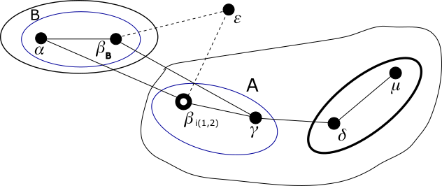
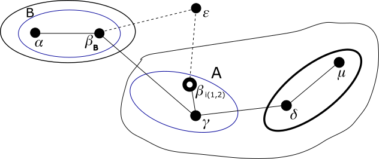

# Modulo QSPN - Esempio di uso degli indirizzi virtuali

## Passo 4
In questo passo assegnamo alla nuova identità di 𝛽, 𝛽<sub>B</sub>, un indirizzo *definitivo* nel g-nodo
g<sub>1</sub>(𝛼). Per l'esattezza gli assegnamo l'indirizzo *virtuale* 0·1·2.

Nel disegno seguente gli archi di 𝛽<sub>B</sub> con 𝛼 e 𝛾 non sono più tratteggiati in quanto 𝛽<sub>B</sub> fa ora parte della rete.



Riassumiamo l'elenco di tutti gli archi ora esistenti coi relativi indirizzi IP link-local:

*   𝛼-𝛽<sub>B</sub>  
    169.254.69.30-169.254.96.141
*   𝛼-𝛽<sub>i(1,2)</sub>  
    169.254.69.30-169.254.27.218
*   𝛾-𝛽<sub>B</sub>  
    169.254.94.223-169.254.96.141
*   𝛾-𝛽<sub>i(1,2)</sub>  
    169.254.94.223-169.254.27.218
*   𝜀-𝛽<sub>B</sub>  
    169.254.163.36-169.254.96.141
*   𝜀-𝛽<sub>i(1,2)</sub>  
    169.254.163.36-169.254.27.218
*   𝛾-𝛿  
    169.254.94.223-169.254.253.216
*   𝛿-𝜇  
    169.254.253.216-169.254.119.176

Non ci sono, comunque, da fare nuove assegnazioni di indirizzi né di rotte verso nodi vicini.

Poiché il nuovo indirizzo *definitivo* di 𝛽<sub>B</sub> è *virtuale* al livello 0, la sua assegnazione
non comporta un comando di assegnazione di indirizzo IP globale nella rete per il sistema 𝛽, né di un indirizzo
*interno* al livello 2, né di un indirizzo *interno* al livello 1.

Ora il nodo 𝛽<sub>B</sub> chiede un ETP completo ai vicini tramite i suoi archi e li processa con questo nuovo
indirizzo. Grazie ad essi:

*   Il nodo 𝛽<sub>B</sub> sa di poter raggiungere il g-nodo 1· passando per l'arco 𝛽<sub>B</sub>-𝛾.
*   Il nodo 𝛽<sub>B</sub> sa di poter raggiungere il nodo 0·1·0 passando per l'arco 𝛽<sub>B</sub>-𝛼.

Quindi diamo questi comandi:

**sistema 𝛽**
```
ip route add 10.0.0.4/30 via 169.254.94.223 dev eth1
ip route add 10.0.0.2/32 via 169.254.69.30 dev eth1
ip route add 10.0.2.2/32 via 169.254.69.30 dev eth1
ip route add 10.0.1.0/32 via 169.254.69.30 dev eth1
```

Il nodo 𝛽<sub>B</sub> avendo ora completato il suo bootstrap, comunica via ETP ai suoi vicini 𝛼 e 𝛾 tutti i
percorsi che conosce. Quindi ora:

*   Il nodo 𝛼 sa di poter raggiungere il g-nodo 1· passando per l'arco 𝛼-𝛽<sub>B</sub>.
*   Il nodo 𝛾 sa di poter raggiungere il g-nodo 0· passando per l'arco 𝛾-𝛽<sub>B</sub>.
*   Il nodo 𝛽<sub>i(1,2)</sub> sa di poter raggiungere il g-nodo 0· passando per l'arco 𝛽<sub>i(1,2)</sub>-𝛾.

Sono conoscenze nuove, ma che non cambiano il miglior percorso verso quelle destinazioni per quei nodi. Quindi nessun comando verrà dato.

Inoltre ora:

*   Il nodo 𝛼 sa di poter raggiungere il nodo 0·1·2 passando per l'arco 𝛼-𝛽<sub>B</sub>.

Anche questa è una conoscenza nuova, ma l'indirizzo di destinazione è *virtuale*. Quindi nessun comando verrà dato.

Ora che il nodo 𝛽<sub>B</sub> ha trasmesso i suoi primi ETP ai diretti vicini 𝛼 e 𝛾, dopo aver atteso
qualche istante per permettere la loro processazione da parte di 𝛼 e 𝛾, il nodo 𝛽<sub>i(1,2)</sub> rimuove
i suoi archi con nodi che non appartengono al suo g-nodo di livello 2. Si ricordi infatti che il livello
più alto in cui i due g-nodi A e B differiscono è 2. Quindi 𝛽<sub>i(1,2)</sub> rimuove il suo arco con il nodo 𝛼.

Questo fa si che il nodo 𝛼 non può più raggiungere il g-nodo 1· passando per l'arco 𝛼-𝛽<sub>i(1,2)</sub>. Però abbiamo
detto prima che aveva appreso di poterlo fare passando per l'arco 𝛼-𝛽<sub>B</sub>.

Va quindi cambiata, dal sistema 𝛼, la rotta verso 10.0.0.4/30, sostituendo il gateway 𝛽<sub>i(1,2)</sub>
con 𝛽<sub>B</sub>. Va poi rimossa, dal sistema 𝛼, la sua rotta verso 𝛽<sub>i(1,2)</sub>.

Va poi rimossa, dal sistema 𝛽, la rotta di 𝛽<sub>i(1,2)</sub> verso 𝛼, e vanno rimosse o cambiate le rotte che
eventualmente si appoggiavano su tale arco.

Quindi diamo questi comandi ai sistemi:

**sistema 𝛼**
```
ip route change 10.0.0.4/30 src 10.0.0.2 via 169.254.96.141 dev eth1
ip route del 169.254.27.218 dev eth1 src 169.254.69.30
```
**sistema 𝛽**
```
ip netns exec ntkv0 ip route change 10.0.0.0/30 via 169.254.94.223 dev ntkv0_eth1
ip netns exec ntkv0 ip route del 169.254.69.30 dev ntkv0_eth1 src 169.254.27.218
```

Ora il nodo 𝛽<sub>B</sub>, avendo rimosso un suo arco, comunica le variazioni apportate alla sua mappa
tramite un ETP agli altri vicini. Quindi il nodo 𝛾, al ricevere tale ETP, sa che non può più raggiungere
il g-nodo 0· passando per l'arco 𝛾-𝛽<sub>i(1,2)</sub>. Però abbiamo detto prima che aveva appreso di
poterlo fare passando per l'arco 𝛾-𝛽<sub>B</sub>. Va quindi cambiata, dal sistema 𝛾, la rotta verso 10.0.0.0/30,
sostituendo il gateway 𝛽<sub>i(1,2)</sub> con 𝛽<sub>B</sub>.

Quindi diamo questi comandi:

**sistema 𝛾**
```
ip route change 10.0.0.0/30 src 10.0.0.6 via 169.254.96.141 dev eth1
```

Riassumiamo l'elenco degli archi ora presenti e il grafo che descrive la rete.

*   𝛼-𝛽<sub>B</sub>
*   𝛾-𝛽<sub>B</sub>
*   𝜀-𝛽<sub>B</sub>
*   𝛾-𝛽<sub>i(1,2)</sub>
*   𝛾-𝛿
*   𝛿-𝜇
*   𝜀-𝛽<sub>i(1,2)</sub>



Temporaneamente, il sistema 𝛽 non è in grado di comunicare con gli altri sistemi della rete in quanto ha
solo indirizzi *virtuali* al livello 0. Nonostante questo, il sistema è perfettamente in grado di inoltrare
pacchetti provenienti da altri sistemi e destinati ad altri sistemi nella rete. Quindi sebbene 𝛽 sia un
punto di articolazione, il grafo resta connesso.

Proseguiamo con il [passo 5](Step5.md).

