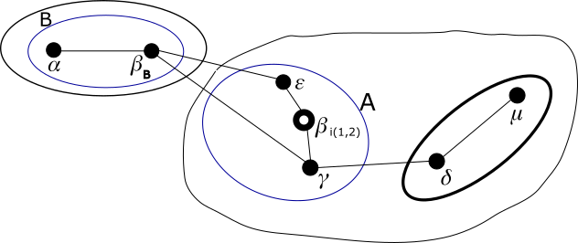

# Modulo QSPN - Esempio di uso degli indirizzi virtuali

## Passo 6

Il sistema 𝜀 può ora entrare in 1·1· grazie al suo link con 𝛽<sub>i(1,2)</sub> e assegnarsi l'indirizzo 1·1·1.



Si vede dal grafo che, pur non essendoci un link diretto tra 𝜀 e 𝛾, che sono i soli nodi in 1·1· con un indirizzo
reale, il g-nodo 1·1· resta internamente connesso.

Quindi diamo questi comandi:

**sistema 𝜀**
```
ip route add unreachable 10.0.0.0/29
ip route add unreachable 10.0.2.0/30
ip route add unreachable 10.0.1.0/31
ip address add 10.0.0.7 dev eth1
ip address add 10.0.2.3 dev eth1
ip address add 10.0.1.1 dev eth1
```

Il nodo 𝜀 chiede e riceve un ETP completo da 𝛽<sub>i(1,2)</sub> e uno da 𝛽<sub>B</sub>. Tramite essi:

*   Il nodo 𝜀 sa di poter raggiungere il g-nodo 0· passando per il vicino 𝛽<sub>B</sub>.
*   Il nodo 𝜀 sa di poter raggiungere il g-nodo 1·0· passando per il vicino 𝛽<sub>i(1,2)</sub>.
*   Il nodo 𝜀 sa di poter raggiungere il nodo 1·1·0 passando per il vicino 𝛽<sub>i(1,2)</sub>.

Quindi diamo questi comandi:

**sistema 𝜀**
```
ip route add 10.0.0.0/30 src 10.0.0.7 via 169.254.96.141 dev eth1
ip route add 10.0.0.4/31 src 10.0.0.7 via 169.254.27.218 dev eth1
ip route add 10.0.0.6/32 src 10.0.0.7 via 169.254.27.218 dev eth1
ip route add 10.0.2.0/31 src 10.0.2.3 via 169.254.27.218 dev eth1
ip route add 10.0.2.2/32 src 10.0.2.3 via 169.254.27.218 dev eth1
ip route add 10.0.1.0/32 src 10.0.1.1 via 169.254.27.218 dev eth1
```

Il nodo 𝜀 ha terminato il bootstrap. Esso ora invia un ETP che informa su come raggiugere 1·1·1. In quanto
ricevuto da 𝛽<sub>i(1,2)</sub> (che fa parte di 1·1·) esso si propaga solo internamente a 1·1·, cioè interessa
𝛽<sub>i(1,2)</sub> e 𝛾. In quanto ricevuto da 𝛽<sub>B</sub> (che fa parte di 0·) esso informa di un nuovo
percorso per raggiungere 1·. Ma ipotiziamo che 𝛽<sub>B</sub> preferisca il vecchio percorso, che passa
per il suo arco con 𝛾, quindi non apporta correzioni e non propaga l'ETP.

Quindi diamo questi comandi:

**sistema 𝛽**
```
ip netns exec ntkv0 ip route add 10.0.0.7/32 via 169.254.163.36 dev ntkv0_eth1
ip netns exec ntkv0 ip route add 10.0.2.3/32 via 169.254.163.36 dev ntkv0_eth1
ip netns exec ntkv0 ip route add 10.0.1.1/32 via 169.254.163.36 dev ntkv0_eth1
```
**sistema 𝛾**
```
ip route add 10.0.0.7/32 src 10.0.0.6 via 169.254.27.218 dev eth1
ip route add 10.0.2.3/32 src 10.0.2.2 via 169.254.27.218 dev eth1
ip route add 10.0.1.1/32 src 10.0.1.0 via 169.254.27.218 dev eth1
```

Possiamo verificare che il sistema 𝜀 raggiunge tutti gli indirizzi IP dei nodi esistenti.

Ora possiamo verificare che il sistema 𝛽, che già fa parte del g-nodo 0·1· con la sua identità 𝛽<sub>B</sub>, è
in grado di smistare correttamente pacchetti IP aventi per destinazione un indirizzo *interno* sia nel
g-nodo 0·1·, sia nel g-nodo 1·1·.

*   Se il sistema 𝛽 invia un pacchetto a 10.0.1.0 (cioè verso il nodo x·x·0 nel g-nodo di livello 1 di cui fa parte 𝛽) raggiunge 𝛼.
*   Se il sistema 𝜀 invia un pacchetto a 10.0.1.0 (cioè verso il nodo x·x·0 nel g-nodo di livello 1 di cui fa parte 𝜀),
    sebbene passa da 𝛽, raggiunge 𝛾.
*   Se il sistema 𝛼 invia un pacchetto a 10.0.2.0 (cioè verso il nodo x·0·0 nel g-nodo di livello 2 di cui fa parte 𝛼) viene
    segnalato irraggiungibile.
*   Se il sistema 𝜀 invia un pacchetto a 10.0.2.0 (cioè verso il nodo x·0·0 nel g-nodo di livello 2 di cui fa parte 𝜀),
    sebbene passa da 𝛽, raggiunge 𝜇.

Proseguiamo con il [passo 7](Step7.md).

