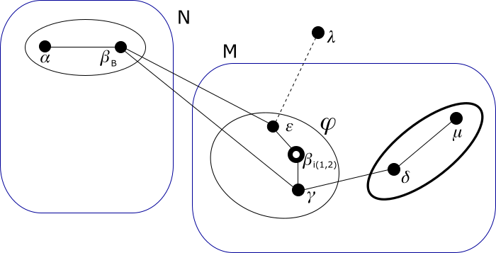

# Modulo QSPN - Esempio di uso degli indirizzi virtuali

## Passo 7

In questo passo simuliamo l'ingresso di un nuovo sistema che forza la migrazione del g-nodo di livello 1 1·1· nel g-nodo
di livello 2 0·, che è non saturo.

Ora nella rete si aggiunge il sistema 𝜆 collegato solo al sistema 𝜀. Esiste l'arco 𝜀-𝜆, ma tale arco non è ancora comunicato
al modulo QSPN in quanto il nodo 𝜆 non fa ancora parte della rete.



Il nuovo sistema si assegna questo indirizzo link-local:

*   𝜆 = 169.254.109.22

Si aggiunge questo arco all'elenco:

*   𝜀-𝜆

Diamo questi comandi ai sistemi:

**sistema 𝜀**
```
ip route add 169.254.109.22 dev eth1 src 169.254.163.36
```
**sistema 𝜆**
```
ip link set eth1 up
ip address add 169.254.109.22 dev eth1
ip route add 169.254.163.36 dev eth1 src 169.254.109.22
```

Il sistema 𝜆 vuole fare da gateway per una sottorete di due indirizzi gestita autonomamente. Quindi vuole
riservarsi un g-nodo di livello 1.

Al livello più alto la rete è satura, non si può costituire un nuovo g-nodo di livello 2. Il sistema 𝜆 vuole
entrare in g<sub>2</sub>(𝜀) = 1· ma è saturo. Come soluzione si sceglie di far migrare tutto il
g-nodo 𝜑 = g<sub>1</sub>(𝜀) = 1·1· in 0·, ma che resti come virtuale in 1· prendendo il primo
identificativo *virtuale* libero nel g-nodo di livello 2 1·, cioè 2. Quindi diventa 1·2·.

I due g-nodi di livello 2 interessati dalla migrazione di 𝜑 sono stati evidenziati nel disegno e contrassegnati con le lettere *M* e *N*.

Si noti che il livello più alto in cui i due g-nodi *M* e *N* differiscono è 2.

Il g-nodo 𝜑 migra in una operazione atomica, cioè tutti i suoi nodi migrano insieme, senza attendere
l'uno le operazioni dell'altro. Alcune operazioni sulle proprie strutture dati interne le faranno tutti
i nodi. Alcuni comandi per il sistema operativo (ad esempio la creazione di pseudo-interfacce e di un network
namespace, l'aggiunta di indirizzi link-local e di rotte dirette) andranno dati su tutti i sistemi.

Le trasmissioni di ETP dovute ai cambi di indirizi di 𝜑 invece le faranno solo i border-nodi e le comunicheranno
solo all'esterno. Le richieste di un ETP completo le faranno solo i border-nodi ai nodi esterni. Con gli ETP
ricevuti i border-nodi acquisiranno nuovi percorsi e propagheranno ai nodi interni questi percorsi con ETP che
viaggeranno solo internamente.

Procediamo.

Ogni nodo del g-nodo 𝜑, per ognuna delle interfacce di rete gestite dal demone *ntkd* nel network namespace default,
costruisce una pseudo-interfaccia a cui associa un nuovo indirizzo IP link-local. Poi le sposta in un nuovo network
namespace. In questo esempio per semplicità chiameremo "ntkv1" il namespace nuovo in tutti i nodi di 𝜑; ma questo non
significa che sia necessario: ad esempio nel sistema 𝛽 potremmo creare il namespace ntkv1, nel sistema 𝛾 potremmo
creare il namespace ntkv0, e così via.

Diamo questi comandi ai sistemi:

**sistema 𝛽**
```
ip link add dev ntkv1_eth1 link eth1 type macvlan
ip netns add ntkv1
ip link set dev ntkv1_eth1 netns ntkv1
ip netns exec ntkv1 ip link set dev ntkv1_eth1 address 92:16:EB:BD:34:98
ip netns exec ntkv1 sysctl -w net.ipv4.conf.ntkv1_eth1.arp_ignore=1
ip netns exec ntkv1 sysctl -w net.ipv4.conf.ntkv1_eth1.arp_announce=2
ip netns exec ntkv1 ip link set ntkv1_eth1 up
ip netns exec ntkv1 ip address add 169.254.42.4 dev ntkv1_eth1
```
**sistema 𝛾**
```
ip link add dev ntkv1_eth1 link eth1 type macvlan
ip netns add ntkv1
ip link set dev ntkv1_eth1 netns ntkv1
ip netns exec ntkv1 ip link set dev ntkv1_eth1 address 3A:01:4E:AF:4C:2A
ip netns exec ntkv1 sysctl -w net.ipv4.conf.ntkv1_eth1.arp_ignore=1
ip netns exec ntkv1 sysctl -w net.ipv4.conf.ntkv1_eth1.arp_announce=2
ip netns exec ntkv1 ip link set ntkv1_eth1 up
ip netns exec ntkv1 ip address add 169.254.24.198 dev ntkv1_eth1
```
**sistema 𝜀**
```
ip link add dev ntkv1_eth1 link eth1 type macvlan
ip netns add ntkv1
ip link set dev ntkv1_eth1 netns ntkv1
ip netns exec ntkv1 ip link set dev ntkv1_eth1 address AE:57:CE:3B:9F:45
ip netns exec ntkv1 sysctl -w net.ipv4.conf.ntkv1_eth1.arp_ignore=1
ip netns exec ntkv1 sysctl -w net.ipv4.conf.ntkv1_eth1.arp_announce=2
ip netns exec ntkv1 ip link set ntkv1_eth1 up
ip netns exec ntkv1 ip address add 169.254.241.153 dev ntkv1_eth1
```

Ogni nodo in 𝜑 crea una sua nuova identità, che si assegna a caso un nuovo identificativo, che userà l'interfaccia
di rete e il network namespace con cui il nodo gestiva il suo precedente indirizzo in 𝜑. Nel dettaglio:

*   Il nodo 𝛽<sub>i(1,2)</sub> crea 𝛽<sub>i(1,2),N</sub> che gestirà "ntkv0_eth1" nel network namespace "ntkv0".
*   Il nodo 𝛾 crea 𝛾<sub>N</sub> che gestirà "eth1" nel network namespace default.
*   Il nodo 𝜀 crea 𝜀<sub>N</sub> che gestirà "eth1" nel network namespace default.

Queste nuove identità formano un gruppo che chiamiamo 𝜑<sub>N</sub>.

Le vecchie identità ora gestiranno indirizzi *di connettività* ai livelli da 2 a 2, virtuali al livello 1. Per
indicare ciò, da ora in poi le chiamiamo 𝛽<sub>i(1,2),i(2,2)</sub>, 𝛾<sub>i(2,2)</sub> e 𝜀<sub>i(2,2)</sub> e chiamiamo il
gruppo 𝜑<sub>i(2,2)</sub>. Queste useranno la pseudo-interfaccia di rete creata adesso nel relativo network namespace. Nel dettaglio:

*   Il nodo 𝛽<sub>i(1,2),i(2,2)</sub> gestirà "ntkv1_eth1" nel network namespace "ntkv1".
*   Il nodo 𝛾<sub>i(2,2)</sub> gestirà "ntkv1_eth1" nel network namespace "ntkv1".
*   Il nodo 𝜀<sub>i(2,2)</sub> gestirà "ntkv1_eth1" nel network namespace "ntkv1".

Ogni nodo in 𝜑, per tutti i suoi archi crea un duplicato che sarà di 𝜑<sub>N</sub>. Poi modifica gli archi vecchi,
quelli che rimangono in 𝜑<sub>i(2,2)</sub>. Per gli archi che aveva con altri nodi in 𝜑 ora l'arco in 𝜑<sub>i(2,2)</sub>
collega la pseudo-interfaccia nuova nell'uno e nell'altro nodo, mentre per  gli archi che aveva con altri nodi che
non appartengono a 𝜑 ora l'arco in 𝜑<sub>i(2,2)</sub> collega la pseudo-interfaccia nuova nell'uno con la vecchia
interfaccia nell'altro. Nel dettaglio:

*   L'arco 𝜀<sub>N</sub>-𝛽<sub>B</sub> è il duplicato del vecchio arco 𝜀-𝛽<sub>B</sub>. Questo collega la "eth1" del nodo 𝜀
    con la "eth1" del nodo 𝛽.
*   L'arco 𝜀<sub>i(2,2)</sub>-𝛽<sub>B</sub> è il vecchio arco 𝜀-𝛽<sub>B</sub> che viene modificato. Ora esso collega la
    "ntkv1_eth1" del nodo 𝜀 con la "eth1" del nodo 𝛽.
*   L'arco 𝜀<sub>N</sub>-𝛽<sub>i(1,2),N</sub> è il duplicato del vecchio arco 𝜀-𝛽<sub>i(1,2)</sub>. Questo collega la
    "eth1" del nodo 𝜀 con la "ntkv0_eth1" del nodo 𝛽.
*   L'arco 𝜀<sub>i(2,2)</sub>-𝛽<sub>i(1,2),i(2,2)</sub> è il vecchio arco 𝜀-𝛽<sub>i(1,2)</sub> che viene modificato. Ora
    esso collega la "ntkv1_eth1" del nodo 𝜀 con la "ntkv1_eth1" del nodo 𝛽.
*   ...

Visualiziamo la rete nel seguente disegno. Come prima, gli elementi rossi sono quelli nuovi, i violetti sono
quelli modificati; gli archi tratteggiati collegano a nodi che non fanno ancora parte della rete.


Ora illustriamo i comandi che vengono dati ai nodi per realizzare queste operazioni. Va considerato che ogni nodo
esterno a 𝜑 che vede una modifica realizzata su un suo vecchio arco (cambia l'indirizzo IP link-local al suo estremo
che è in 𝜑) deve anche apportare la relativa variazione alle rotte che aveva memorizzato in precedenza e che usavano
quell'arco come gateway.

**Nota:** Tutte queste operazioni (sia quelle che riguardano gli indirizzi link-local nuovi e i
collegamenti diretti coi link-local vicini, sia quelle che riguardano la modifica delle rotte che usano
come gateway i nuovi link-local dei vicini) non coinvolgono affatto il modulo Qspn. Esse sono portate avanti
dalla collaborazione fra il modulo Identities e il suo utilizzatore. Le riportiamo in questo esempio per
completezza.

Diamo questi comandi ai sistemi:

**sistema 𝛽**
```
# come 𝛽B
ip route add 169.254.241.153 dev eth1 src 169.254.96.141
ip route add 169.254.24.198 dev eth1 src 169.254.96.141
ip route change 10.0.0.4/30 src 10.0.0.3 via 169.254.24.198 dev eth1
# come 𝛽i12,N
# come 𝛽i12,i22
ip netns exec ntkv1 ip route add 169.254.241.153 dev ntkv1_eth1 src 169.254.42.4
ip netns exec ntkv1 ip route add 169.254.24.198 dev ntkv1_eth1 src 169.254.42.4
ip netns exec ntkv1 ip route add unreachable 10.0.0.0/29
ip netns exec ntkv1 ip route add unreachable 10.0.2.0/30
ip netns exec ntkv1 ip route add unreachable 10.0.1.0/31
```
**sistema 𝛾**
```
# come 𝛾N
# come 𝛾i22
ip netns exec ntkv1 ip route add 169.254.96.141 dev ntkv1_eth1 src 169.254.24.198
ip netns exec ntkv1 ip route add 169.254.42.4 dev ntkv1_eth1 src 169.254.24.198
ip netns exec ntkv1 ip route add 169.254.253.216 dev ntkv1_eth1 src 169.254.24.198
ip netns exec ntkv1 ip route add unreachable 10.0.0.0/29
ip netns exec ntkv1 ip route add unreachable 10.0.2.0/30
ip netns exec ntkv1 ip route add unreachable 10.0.1.0/31
```
**sistema 𝛿**
```
ip route add 169.254.24.198 dev eth1 src 169.254.253.216
ip route change 10.0.0.0/30 via 169.254.24.198 dev eth1 src 10.0.0.5
ip route change 10.0.0.6/31 via 169.254.24.198 dev eth1 src 10.0.0.5
ip route change 10.0.2.2/31 via 169.254.24.198 dev eth1 src 10.0.2.1
```
**sistema 𝜀**
```
# come 𝜀N
# come 𝜀i22
ip netns exec ntkv1 ip route add 169.254.96.141 dev ntkv1_eth1 src 169.254.241.153
ip netns exec ntkv1 ip route add 169.254.42.4 dev ntkv1_eth1 src 169.254.241.153
ip netns exec ntkv1 ip route add 169.254.109.22 dev ntkv1_eth1 src 169.254.241.153
ip netns exec ntkv1 ip route add unreachable 10.0.0.0/29
ip netns exec ntkv1 ip route add unreachable 10.0.2.0/30
ip netns exec ntkv1 ip route add unreachable 10.0.1.0/31
```
**sistema 𝜆**
```
ip route add 169.254.241.153 dev eth1 src 169.254.109.22
```

I nodi in 𝜑<sub>i(2,2)</sub>, quindi in riferimento alla loro identità che mantiene l'indirizzo *di connettività* nel
network namespace "ntkv1", trasformano il loro precedente indirizzo 1·1·X in 1·2·X che è *di connettività*
ai livelli da 2 a 2. Nel dettaglio:

*   Il nodo 𝛽<sub>i(1,2),i(2,2)</sub> trasforma il suo indirizzo da 1·1·2 a 1·2·2. Poiché era in precedenza un
    nodo *di connettività* ai livelli da 1 a 2, diventa un nodo *di connettività* ai livelli da 1 a 2.
*   Il nodo 𝛾<sub>i(2,2)</sub> trasforma il suo indirizzo da 1·1·0 a 1·2·0. Diventa un nodo *di connettività* ai livelli da 2 a 2.
*   Il nodo 𝜀<sub>i(2,2)</sub> trasforma il suo indirizzo da 1·1·1 a 1·2·1. Diventa un nodo *di connettività* ai livelli da 2 a 2.

Riguardando la regola generale descritta nel passo 3 sulle operazioni da fare con gli indirizzi e le rotte, poiché
il g-nodo 𝜑 diventa *di connettività* ai livelli da 2 a 2 e quindi *virtuale* al livello 1, i nodi in esso fanno queste operazioni:

*   Vengono copiati nel network namespace ntkv1 gli indirizzi interni ai propri g-nodi di livello minore
    di 2, cioè quelli in 10.0.1.X.  
    **TODO:** Passo superfluo.
*   Le rotte verso nodi contenuti nel nostro g-nodo di livello 1:
    *   Quelle espresse con indirizzi *interni* al g-nodo di livello 1 vanno mantenute nel network namespace vecchio e
        copiate nel network namespace ntkv1. Inoltre, essendo nel network namespace ntkv1, se usano come gateway un nodo
        in 𝜑 devono usare il nuovo indirizzo IP link-local del gateway in 𝜑<sub>i(2,2)</sub>.
    *   Quelle espresse con indirizzi globali o con indirizzi interni ai livelli superiori, vanno rimosse dal network namespace vecchio.
*   Le rotte verso g-nodi di livello *k* (quindi contenuti nel nostro g-nodo di livello *k* + 1), con *k* ≥ 1, sia
    quelle espresse con indirizzi globali che quelle espresse con indirizzi *interni* ai vari livelli, vanno spostate
    dal network namespace vecchio nel network namespace ntkv1, ma senza avere un source preferito. Inoltre, essendo nel
    network namespace ntkv1, se usano come gateway un nodo in 𝜑 devono usare il nuovo indirizzo IP link-local del gateway
    in 𝜑<sub>i(2,2)</sub>.
*   Vengono rimossi l'indirizzo globale e gli indirizzi interni ai propri g-nodi di livello maggiore o uguale a 2 dal
    network namespace vecchio. Vi restano quindi quelli in 10.0.1.X.

Quindi diamo questi comandi:

**sistema 𝛽**
```
ip netns exec ntkv1 ip route add 10.0.1.0/32 via 169.254.24.198 dev ntkv1_eth1
ip netns exec ntkv1 ip route add 10.0.1.1/32 via 169.254.241.153 dev ntkv1_eth1
ip netns exec ntkv0 ip route del 10.0.0.6/32 via 169.254.94.223 dev ntkv0_eth1
ip netns exec ntkv0 ip route del 10.0.0.7/32 via 169.254.163.36 dev ntkv0_eth1
ip netns exec ntkv0 ip route del 10.0.2.2/32 via 169.254.94.223 dev ntkv0_eth1
ip netns exec ntkv0 ip route del 10.0.2.3/32 via 169.254.163.36 dev ntkv0_eth1
ip netns exec ntkv1 ip route add 10.0.0.0/30 via 169.254.24.198 dev ntkv1_eth1
ip netns exec ntkv0 ip route del 10.0.0.0/30 via 169.254.94.223 dev ntkv0_eth1
ip netns exec ntkv1 ip route add 10.0.0.4/31 via 169.254.24.198 dev ntkv1_eth1
ip netns exec ntkv0 ip route del 10.0.0.4/31 via 169.254.94.223 dev ntkv0_eth1
ip netns exec ntkv1 ip route add 10.0.2.0/31 via 169.254.24.198 dev ntkv1_eth1
ip netns exec ntkv0 ip route del 10.0.2.0/31 via 169.254.94.223 dev ntkv0_eth1
```
**sistema 𝛾**
```
ip netns exec ntkv1 ip address add 10.0.1.0 dev ntkv1_eth1
ip netns exec ntkv1 ip route add 10.0.1.1/32 via 169.254.42.4 dev ntkv1_eth1 src 10.0.1.0
ip route del 10.0.0.7/32 via 169.254.27.218 dev eth1 src 10.0.0.6
ip route del 10.0.2.3/32 via 169.254.27.218 dev eth1 src 10.0.2.2
ip netns exec ntkv1 ip route add 10.0.0.0/30 via 169.254.96.141 dev ntkv1_eth1
ip route del 10.0.0.0/30 via 169.254.96.141 dev eth1 src 10.0.0.6
ip netns exec ntkv1 ip route add 10.0.0.4/31 via 169.254.253.216 dev ntkv1_eth1
ip route del 10.0.0.4/31 via 169.254.253.216 dev eth1 src 10.0.0.6
ip netns exec ntkv1 ip route add 10.0.2.0/31 via 169.254.253.216 dev ntkv1_eth1
ip route del 10.0.2.0/31 via 169.254.253.216 dev eth1 src 10.0.2.2
ip address del 10.0.0.6/32 dev eth1
ip address del 10.0.2.2/32 dev eth1
```
**sistema 𝜀**
```
ip netns exec ntkv1 ip address add 10.0.1.1 dev ntkv1_eth1
ip netns exec ntkv1 ip route add 10.0.1.0/32 via 169.254.42.4 dev ntkv1_eth1 src 10.0.1.1
ip route del 10.0.0.6/32 via 169.254.27.218 dev eth1 src 10.0.0.7
ip route del 10.0.2.2/32 via 169.254.27.218 dev eth1 src 10.0.2.3
ip netns exec ntkv1 ip route add 10.0.0.0/30 via 169.254.96.141 dev ntkv1_eth1
ip route del 10.0.0.0/30 via 169.254.96.141 dev eth1 src 10.0.0.7
ip netns exec ntkv1 ip route add 10.0.0.4/31 via 169.254.42.4 dev ntkv1_eth1
ip route del 10.0.0.4/31 via 169.254.27.218 dev eth1 src 10.0.0.7
ip netns exec ntkv1 ip route add 10.0.2.0/31 via 169.254.42.4 dev ntkv1_eth1
ip route del 10.0.2.0/31 via 169.254.27.218 dev eth1 src 10.0.2.3
ip address del 10.0.0.7/32 dev eth1
ip address del 10.0.2.3/32 dev eth1
```

Vediamo ora le comunicazioni del g-nodo 𝜑 agli altri g-nodi. Ogni border-nodo di 𝜑 trasmette un ETP ai suoi vicini che
non appartengono a 𝜑. In questo ETP comunica che non è più possibile raggiungere tramite lui l'indirizzo 1·1·; e che
ora è possibile raggiungere tramite lui l'indirizzo 1·2·.

Questo ETP viene recepito solo dai nodi del g-nodo di livello 2, trattandosi di due percorsi verso g-nodi di livello 1,
cioè solo dai nodi 𝛿 e 𝜇. Inoltre la comunicazione relativa all'indirizzo virtuale 2·1· viene recepita ma non comporta
alcun comando al sistema operativo.

Quindi diamo questi comandi ai sistemi: 

**sistema 𝛿**
```
ip route del 10.0.0.6/31 via 169.254.24.198 dev eth1 src 10.0.0.5
ip route del 10.0.2.2/31 via 169.254.24.198 dev eth1 src 10.0.2.1
```
**sistema 𝜇**
```
ip route del 10.0.0.6/31 via 169.254.253.216 dev eth1 src 10.0.0.4
ip route del 10.0.2.2/31 via 169.254.253.216 dev eth1 src 10.0.2.0
```

Dopo tutti questi comandi, il g-nodo 𝜑 non è in grado di comunicare con gli altri g-nodi della rete, ma è in grado di
inoltrare i pacchetti. Quindi la rete rimane connessa: ad esempio, il nodo 𝛼 è in grado di comunicare con il nodo 𝜇 usando
il suo indirizzo globale.

Inoltre, all'interno del g-nodo 𝜑 i singoli nodi (vale a dire 𝜀 e 𝛾) possono comunicare tra loro usando i loro indirizzi
IP *interni* al g-nodo di livello 1. E le connessioni che erano state aperte tra 𝜀 e 𝛾 (sempre con gli indirizzi IP
*interni*) prima di queste operazioni sono tuttora funzionanti.

Proseguiamo con il [passo 8](Step8.md).

