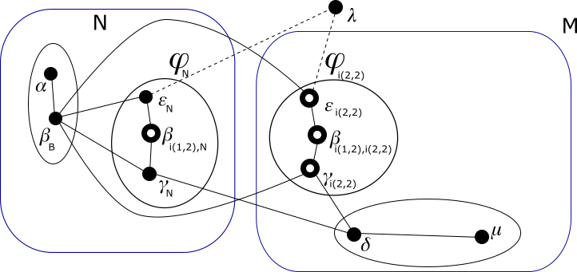
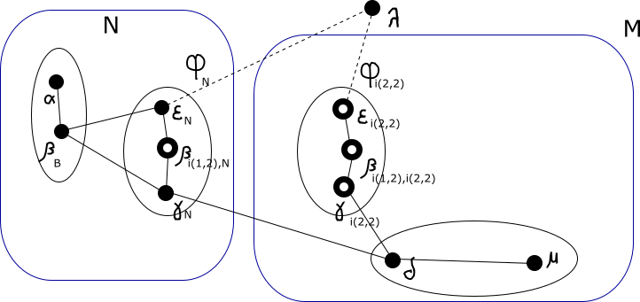

# Modulo QSPN - Esempio di uso degli indirizzi virtuali

## Passo 8

In questo passo assegnamo alle nuove identità in 𝜑<sub>N</sub>, un indirizzo *definitivo* nel g-nodo *N*. Per
l'esattezza gli assegnamo l'indirizzo *virtuale* 0·2·.

Nel disegno seguente gli archi che collegano nodi che ora fanno parte della rete non sono più tratteggiati.



Poiché i nuovi indirizzi *definitivi* sono *virtuali* al livello 1, la loro assegnazione non comporta un comando
di assegnazione di indirizzo IP globale nella rete per i sistemi in 𝜑<sub>N</sub>, né di un indirizzo *interno* al
livello 2. I sistemi in 𝜑<sub>N</sub> avevano già assegnato un indirizzo IP *interno* al livello 1.

Ora ogni border-nodo in 𝜑<sub>N</sub> chiede un ETP completo ai vicini che non appartengono a 𝜑<sub>N</sub> tramite
i suoi archi e li processa con questo nuovo indirizzo. Grazie ad essi:

*   Il nodo 𝜀<sub>N</sub> sa di poter raggiungere il g-nodo 0·1· passando per l'arco 𝜀<sub>N</sub>-𝛽<sub>B</sub>.
*   Il nodo 𝜀<sub>N</sub> sa di poter raggiungere il g-nodo 1· passando per l'arco 𝜀<sub>N</sub>-𝛽<sub>B</sub>. Il
    percorso sarebbe 𝜀<sub>N</sub>-𝛽<sub>B</sub>-𝛾<sub>i(2,2)</sub>. Si tratta di un percorso che rimarrà valido
    per poco tempo in quanto l'arco 𝛽<sub>B</sub>-𝛾<sub>i(2,2)</sub> sparirà presto. Ma a quel punto potrà avvalersi
    di un altro percorso, 𝜀<sub>N</sub>-𝛽<sub>i(1,2),N</sub>-𝛾<sub>N</sub>-𝛿 che verrà scoperto a breve.
*   Il nodo 𝛾<sub>N</sub> sa di poter raggiungere il g-nodo 0·1· passando per l'arco 𝛾<sub>N</sub>-𝛽<sub>B</sub>.
*   Il nodo 𝛾<sub>N</sub> sa di poter raggiungere il g-nodo 1· passando per l'arco 𝛾<sub>N</sub>-𝛿.

Quindi diamo questi comandi:

**sistema 𝜀**
```
ip route add 10.0.0.2/31 via 169.254.96.141 dev eth1
ip route add 10.0.2.2/31 via 169.254.96.141 dev eth1
ip route add 10.0.0.4/30 via 169.254.96.141 dev eth1
```
**sistema 𝛾**
```
ip route add 10.0.0.2/31 via 169.254.96.141 dev eth1
ip route add 10.0.2.2/31 via 169.254.96.141 dev eth1
ip route add 10.0.0.4/30 via 169.254.253.216 dev eth1
```

I border-nodi in 𝜑<sub>N</sub> potrebbero anche chiedere un ETP ai vicini che appartengono a 𝜑<sub>N</sub>, ma
effettivamente non lo otterrebbero perché questi non hanno completato il loro bootstrap.

Invece bisogna notare che i nodi in 𝜑<sub>N</sub> che non sono border-nodi, sebbene non ricevano immediatamente
alcun ETP dai loro vicini, non devono considerare fallito il loro ingresso nella rete. Tra
l'altro essi hanno ricevuto dalla loro precedente identità alcuni percorsi verso g-nodi di livello inferiore a
1 (il livello della migrazione).

Poi i border-nodi in 𝜑<sub>N</sub> avendo completato la fase di bootstrap ritrasmettono un ETP completo ai vicini.
In questo modo le conoscenze riprendono a propagarsi sia ai nodi interni a 𝜑<sub>N</sub> che al di fuori. Riassumiamo
queste nuove conoscenze:

*   Il nodo 𝛽<sub>B</sub> sa di poter raggiungere il g-nodo 0·2· passando per l'arco 𝛽<sub>B</sub>-𝜀<sub>N</sub>.
*   Il nodo 𝛽<sub>B</sub> sa di poter raggiungere il g-nodo 0·2· passando per l'arco 𝛽<sub>B</sub>-𝛾<sub>N</sub>.
    Supponiamo che preferisca il precedente arco 𝛽<sub>B</sub>-𝜀<sub>N</sub>.  
    Per ora, siccome l'indirizzo di destinazione è *virtuale*, questo non comporta alcun comando.
*   Il nodo 𝛽<sub>B</sub> sa di poter raggiungere il g-nodo 1· passando per l'arco 𝛽<sub>B</sub>-𝛾<sub>N</sub>. Già
    sapeva di poterlo fare passando per l'arco 𝛽<sub>B</sub>-𝛾<sub>i(2,2)</sub>. Per ora non cambia la rotta che
    già aveva impostata.
*   Il nodo 𝛼 sa di poter raggiungere il g-nodo 0·2· passando per l'arco 𝛼-𝛽<sub>B</sub>.  
    Per ora, siccome l'indirizzo di destinazione è *virtuale*, questo non comporta alcun comando.
*   Il nodo 𝛿 sa di poter raggiungere il g-nodo 0· passando per l'arco 𝛿-𝛾<sub>N</sub>. Già sapeva di poterlo fare
    passando per l'arco 𝛿-𝛾<sub>i(2,2)</sub>. Questo nuovo percorso è certamente migliore, quindi cambia la rotta che
    già aveva impostata.
*   Per quanto sopra, il nodo 𝛾<sub>i(2,2)</sub> apprende il percorso verso il g-nodo 0· costituito dagli
    archi 𝛾<sub>i(2,2)</sub>-𝛿-𝛾<sub>N</sub>. Per ora tale percorso non migliora il vecchio 𝛾<sub>i(2,2)</sub>-𝛽<sub>B</sub>,
    quindi non cambia la rotta che già aveva impostata.
*   Per quanto sopra, il nodo 𝛽<sub>i(1,2),i(2,2)</sub> apprende il percorso verso il g-nodo 0· costituito dagli
    archi 𝛽<sub>i(1,2),i(2,2)</sub>-𝛾<sub>i(2,2)</sub>-𝛿-𝛾<sub>N</sub>. Per ora tale percorso non migliora il
    vecchio 𝛽<sub>i(1,2),i(2,2)</sub>-𝛾<sub>i(2,2)</sub>-𝛽<sub>B</sub>, quindi non cambia la rotta che già aveva
    impostata. Tra l'altro il gateway sarebbe rimasto lo stesso.
*   Per quanto sopra, il nodo 𝜀<sub>i(2,2)</sub> apprende il percorso verso il g-nodo 0· costituito dagli
    archi 𝜀<sub>i(2,2)</sub>-𝛽<sub>i(1,2),i(2,2)</sub>-𝛾<sub>i(2,2)</sub>-𝛿-𝛾<sub>N</sub>. Per ora tale percorso
    non migliora il vecchio 𝜀<sub>i(2,2)</sub>-𝛽<sub>B</sub>, quindi non cambia la rotta che già aveva impostata.
*   Il nodo 𝛽<sub>i(1,2),N</sub> sa di poter raggiungere il g-nodo 0·1· passando per l'arco 𝛽<sub>i(1,2),N</sub>-𝜀<sub>N</sub>.
*   Il nodo 𝛽<sub>i(1,2),N</sub> sa di poter raggiungere il g-nodo 0·1· passando per l'arco 𝛽<sub>i(1,2),N</sub>-𝛾<sub>N</sub>.
    Supponiamo che preferisca il precedente arco 𝛽<sub>i(1,2),N</sub>-𝜀<sub>N</sub>.
*   Il nodo 𝛽<sub>i(1,2),N</sub> sa di poter raggiungere il g-nodo 1· passando per l'arco 𝛽<sub>i(1,2),N</sub>-𝛾<sub>N</sub>.
*   Il nodo 𝛽<sub>i(1,2),N</sub> sa di poter raggiungere il g-nodo 1· passando per l'arco 𝛽<sub>i(1,2),N</sub>-𝜀<sub>N</sub>.
    Il percorso sarebbe 𝛽<sub>i(1,2),N</sub>-𝜀<sub>N</sub>-𝛽<sub>B</sub>-𝛾<sub>i(2,2)</sub>. Supponiamo che preferisca
    il precedente arco 𝛽<sub>i(1,2),N</sub>-𝛾<sub>N</sub>.
*   Il nodo 𝜀<sub>N</sub> sa di poter raggiungere il g-nodo 0·1· passando per l'arco 𝜀<sub>N</sub>-𝛽<sub>i(1,2),N</sub>. Questo
    percorso di sicuro non è migliore di quello che già conosceva attraverso l'arco 𝜀<sub>N</sub>-𝛽<sub>B</sub>.
*   Il nodo 𝜀<sub>N</sub> sa di poter raggiungere il g-nodo 1· passando per l'arco 𝜀<sub>N</sub>-𝛽<sub>i(1,2),N</sub>. Per ora
    di sicuro il nodo preferisce il percorso che conosceva: 𝜀<sub>N</sub>-𝛽<sub>B</sub>-𝛾<sub>i(2,2)</sub>.
*   Il nodo 𝛾<sub>N</sub> sa di poter raggiungere il g-nodo 0·1· passando per l'arco 𝛾<sub>N</sub>-𝛽<sub>i(1,2),N</sub>. Per ora
    di sicuro il nodo preferisce il percorso che conosceva: 𝛾<sub>N</sub>-𝛽<sub>B</sub>.
*   Il nodo 𝛾<sub>N</sub> sa di poter raggiungere il g-nodo 1· passando per l'arco 𝛾<sub>N</sub>-𝛽<sub>i(1,2),N</sub>. Il percorso
    sarebbe 𝛾<sub>N</sub>-𝛽<sub>i(1,2),N</sub>-𝜀<sub>N</sub>-𝛽<sub>B</sub>-𝛾<sub>i(2,2)</sub>. Supponiamo che preferisca il
    precedente arco 𝛾<sub>N</sub>-𝛿.

Quindi diamo questi comandi:

**sistema 𝛽**
```
ip netns exec ntkv0 ip route add 10.0.0.2/31 via 169.254.163.36 dev ntkv0_eth1
ip netns exec ntkv0 ip route add 10.0.2.2/31 via 169.254.163.36 dev ntkv0_eth1
ip netns exec ntkv0 ip route add 10.0.0.4/30 via 169.254.94.223 dev ntkv0_eth1
```
**sistema 𝛿**
```
ip route change 10.0.0.0/30 via 169.254.94.223 dev eth1 src 10.0.0.5
```

Ora i border-nodi in 𝜑<sub>N</sub>, avendo trasmesso i primi ETP e atteso qualche istante per la loro processazione
da parte dei vicini, con le loro identità in 𝜑<sub>i(2,2)</sub> rimuovono i loro archi con nodi che non appartengono
al loro g-nodo di livello 2. Si ricordi infatti che il livello più alto in cui i due g-nodi *M* e *N* differiscono
è 2. Quindi 𝜀<sub>i(2,2)</sub> rimuove il suo arco con 𝛽<sub>B</sub> e 𝛾<sub>i(2,2)</sub> rimuove il suo arco con 𝛽<sub>B</sub>.

Ricordiamo che:

*   Il nodo 𝛽<sub>B</sub> conosce un percorso verso il g-nodo 1· per l'arco 𝛽<sub>B</sub>-𝛾<sub>N</sub>.
*   Il nodo 𝛾<sub>i(2,2)</sub> conosce un percorso verso il g-nodo 0· per l'arco 𝛾<sub>i(2,2)</sub>-𝛿.
*   Il nodo 𝛽<sub>i(1,2),i(2,2)</sub> conosce un percorso verso il g-nodo 0· per l'arco 𝛽<sub>i(1,2),i(2,2)</sub>-𝛾<sub>i(2,2)</sub>.
*   Il nodo 𝜀<sub>i(2,2)</sub> conosce un percorso verso il g-nodo 0· per l'arco 𝜀<sub>i(2,2)</sub>-𝛽<sub>i(1,2),i(2,2)</sub>.

Quindi diamo questi comandi:

**sistema 𝛽**
```
ip r change 10.0.0.4/30 via 169.254.94.223 dev eth1 src 10.0.0.3
ip route del 169.254.241.153 dev eth1 src 169.254.96.141
ip route del 169.254.24.198 dev eth1 src 169.254.96.141
```
**sistema 𝜀**
```
ip netns exec ntkv1 ip route change 10.0.0.0/30 via 169.254.42.4 dev ntkv1_eth1
ip netns exec ntkv1 ip route del 169.254.96.141 dev ntkv1_eth1 src 169.254.241.153
```
**sistema 𝛾**
```
ip netns exec ntkv1 ip route change 10.0.0.0/30 via 169.254.253.216 dev ntkv1_eth1
ip netns exec ntkv1 ip route del 169.254.96.141 dev ntkv1_eth1 src 169.254.24.198
```

Aggiorniamo il disegno.



Gli stessi border-nodi in 𝜑<sub>N</sub> che hanno rimosso questi archi, ora comunicano le variazioni apportate
alla loro mappa tramite un ETP agli altri vicini. Si aggiungono queste conoscenze:

*   Il nodo 𝛽<sub>i(1,2),i(2,2)</sub> non ha più il percorso 𝛽<sub>i(1,2),i(2,2)</sub>-𝛾<sub>i(2,2)</sub>-𝛽<sub>B</sub> per
    raggiungere il g-nodo 0·, ma solo 𝛽<sub>i(1,2),i(2,2)</sub>-𝛾<sub>i(2,2)</sub>-𝛿-𝛾<sub>N</sub>. Dovrebbe cambiare
    la rotta che aveva impostata, ma il gateway rimane lo stesso quindi non darà alcun comando.

Non risultano necessari altri comandi.

Proseguiamo con il [passo 9](Step9.md).

