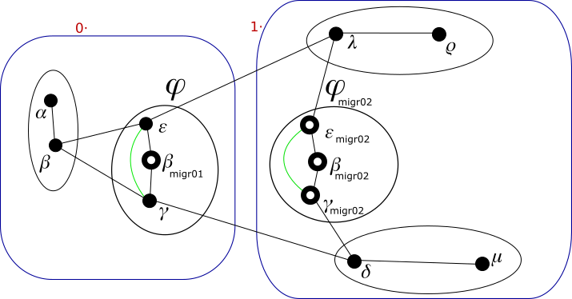

# Proof of concept - Casi d'uso - Pagina 18

[Pagina precedente](UseCases17.md)

## Rimozione identità di connettività

Ora analiziamo alcune delle dinamiche nella rete che possono portare alla rimozione di identità *di connettività* sui sistemi.

Supponiamo che a causa di variazioni nelle condizioni atmosferiche, ora il sistema *𝜀* e il sistema *𝛾* sono a distanza di
rilevamento con la loro interfaccia "eth1". Lo visualiziamo nel disegno seguente con una linea verde.

##### <a name="grafo_3"></a>Grafo 3


Siccome entrambi i sistemi hanno due identità devono valutare quali archi-identità vanno formati. L'identità principale di un
sistema è sempre disponibile a formare un arco-identità con qualsiasi altra identità. Una identità di supporto alla connettività
dei suoi g-nodi dal livello *i* al livello *j* è disposta a formare archi-identità solo con identità che appartengono al suo
stesso g-nodo di livello *j*. L'arco-identità tra due identità si forma solo se entrambe le identità sono disposte.

Analiziamo il nostro caso. Indichiamo con *𝜀<sub>P</sub>* e con *𝛾<sub>P</sub>* le due identità *principali*. Indichiamo con
*𝜀<sub>migr02</sub>* e con *𝛾<sub>migr02</sub>* le due identità nel namespace *migr02*.

*   Si forma l'arco-identità fra le due identità *principali* nel sistema *𝜀* e nel sistema *𝛾*.
*   L'identità *𝜀<sub>migr02</sub>* supporta la connettività di 1·. L'identità *𝛾<sub>P</sub>* invece
    appartiene a 0·. Quindi non si forma questo arco.
*   Analogamente, l'identità *𝛾<sub>migr02</sub>* supporta la connettività di 1·. L'identità *𝜀<sub>P</sub>*
    invece appartiene a 0·. Quindi non si forma questo arco.
*   L'identità *𝜀<sub>migr02</sub>* supporta la connettività di 1·. L'identità *𝛾<sub>migr02</sub>* appartiene a 1·,
    quindi *𝜀<sub>migr02</sub>* è disposta a formare l'arco.  
    Allo stesso tempo, *𝛾<sub>migr02</sub>* supporta la connettività di 1·. Siccome *𝜀<sub>migr02</sub>* appartiene a 1·,
    anche *𝛾<sub>migr02</sub>* è disposta a formare l'arco. Quindi si forma questo arco-identità.

Lo visualiziamo nel disegno seguente con una linea verde.

##### <a name="grafo_4"></a>Grafo 4



Il modulo Neighborhood produce questi comandi ai sistemi:

**sistema 𝛾**
```
ip route add 169.254.163.36 dev eth1 src 169.254.94.223
```

**sistema 𝜀**
```
ip route add 169.254.94.223 dev eth1 src 169.254.163.36
```

Il modulo Identities produce questi comandi ai sistemi:

**sistema 𝛾**
```
ip netns exec migr02 ip route add 169.254.241.153 dev migr02_eth1 src 169.254.24.198
```

**sistema 𝜀**
```
ip netns exec migr02 ip route add 169.254.24.198 dev migr02_eth1 src 169.254.241.153
```

La presenza di un nuovo arco su ciascuna delle 4 identità coinvolte scatena una serie di trasmissioni di
ETP, al termine delle quali abbiamo queste nuove conoscenze:

*   Il nodo **𝛾** conosce un nuovo percorso per 0·0·1 costituito dall'arco **𝛾-𝜀**.
*   Il nodo **𝜀** conosce un nuovo percorso per 0·0·0 costituito dall'arco **𝜀-𝛾**.
*   Il nodo **𝛽<sub>migr01</sub>** conosce un nuovo percorso per 0·0·0 costituito dagli
    archi **𝛽<sub>migr01</sub>-𝜀-𝛾** e un nuovo percorso per 0·0·1 costituito dagli
    archi **𝛽<sub>migr01</sub>-𝛾-𝜀**.
*   Il nodo **𝛾<sub>migr02</sub>** conosce un nuovo percorso per 1·2·1 costituito dall'arco **𝛾<sub>migr02</sub>-𝜀<sub>migr02</sub>**.
*   Il nodo **𝜀<sub>migr02</sub>** conosce un nuovo percorso per 1·2·0 costituito dall'arco **𝜀<sub>migr02</sub>-𝛾<sub>migr02</sub>**.
*   Il nodo **𝛽<sub>migr02</sub>** conosce un nuovo percorso per 1·2·0 costituito dagli
    archi **𝛽<sub>migr02</sub>-𝜀<sub>migr02</sub>-𝛾<sub>migr02</sub>** e un nuovo percorso per 1·2·1 costituito
    dagli archi **𝛽<sub>migr02</sub>-𝛾<sub>migr02</sub>-𝜀<sub>migr02</sub>**.

Tralasciamo di descrivere i comandi che sui vari nodi queste nuove conoscenze potrebbero scatenare o
meno (sulla base dei costi dei vari archi). Indichiamo soltanto i comandi che portano nei
sistemi *𝛾* e *𝜀* alla creazione e popolamento iniziale delle nuove tabelle `ntk_from_xxx`.

**sistema 𝛾**
```
(echo; echo "246 ntk_from_00:16:3E:3C:14:33 # xxx_table_ntk_from_00:16:3E:3C:14:33_xxx") | tee -a /etc/iproute2/rt_tables >/dev/null
ip route add unreachable 10.0.0.0/29 table ntk_from_00:16:3E:3C:14:33
ip route add unreachable 10.0.0.64/29 table ntk_from_00:16:3E:3C:14:33
ip route add unreachable 10.0.0.8/29 table ntk_from_00:16:3E:3C:14:33
ip route add unreachable 10.0.0.72/29 table ntk_from_00:16:3E:3C:14:33
ip route add unreachable 10.0.0.24/29 table ntk_from_00:16:3E:3C:14:33
ip route add unreachable 10.0.0.88/29 table ntk_from_00:16:3E:3C:14:33
ip route add unreachable 10.0.0.20/30 table ntk_from_00:16:3E:3C:14:33
ip route add unreachable 10.0.0.84/30 table ntk_from_00:16:3E:3C:14:33
ip route add unreachable 10.0.0.60/30 table ntk_from_00:16:3E:3C:14:33
ip route add unreachable 10.0.0.18/31 table ntk_from_00:16:3E:3C:14:33
ip route add unreachable 10.0.0.82/31 table ntk_from_00:16:3E:3C:14:33
ip route add unreachable 10.0.0.58/31 table ntk_from_00:16:3E:3C:14:33
ip route add unreachable 10.0.0.50/31 table ntk_from_00:16:3E:3C:14:33
ip route add unreachable 10.0.0.17/32 table ntk_from_00:16:3E:3C:14:33
ip route add unreachable 10.0.0.81/32 table ntk_from_00:16:3E:3C:14:33
ip route add unreachable 10.0.0.57/32 table ntk_from_00:16:3E:3C:14:33
ip route add unreachable 10.0.0.49/32 table ntk_from_00:16:3E:3C:14:33
ip route add unreachable 10.0.0.41/32 table ntk_from_00:16:3E:3C:14:33
iptables -t mangle -A PREROUTING -m mac --mac-source 00:16:3E:3C:14:33 -j MARK --set-mark 246
ip rule add fwmark 246 table ntk_from_00:16:3E:3C:14:33

(echo; echo "245 ntk_from_00:16:3E:3B:9F:45 # xxx_table_ntk_from_00:16:3E:3B:9F:45_xxx") | tee -a /etc/iproute2/rt_tables >/dev/null
ip netns exec migr02 ip route add unreachable 10.0.0.0/29 table ntk_from_00:16:3E:3B:9F:45
ip netns exec migr02 ip route add unreachable 10.0.0.64/29 table ntk_from_00:16:3E:3B:9F:45
ip netns exec migr02 ip route add unreachable 10.0.0.8/29 table ntk_from_00:16:3E:3B:9F:45
ip netns exec migr02 ip route add unreachable 10.0.0.72/29 table ntk_from_00:16:3E:3B:9F:45
ip netns exec migr02 ip route add unreachable 10.0.0.24/29 table ntk_from_00:16:3E:3B:9F:45
ip netns exec migr02 ip route add unreachable 10.0.0.88/29 table ntk_from_00:16:3E:3B:9F:45
ip netns exec migr02 ip route add unreachable 10.0.0.16/30 table ntk_from_00:16:3E:3B:9F:45
ip netns exec migr02 ip route add unreachable 10.0.0.80/30 table ntk_from_00:16:3E:3B:9F:45
ip netns exec migr02 ip route add unreachable 10.0.0.56/30 table ntk_from_00:16:3E:3B:9F:45
ip netns exec migr02 ip route add unreachable 10.0.0.20/31 table ntk_from_00:16:3E:3B:9F:45
ip netns exec migr02 ip route add unreachable 10.0.0.84/31 table ntk_from_00:16:3E:3B:9F:45
ip netns exec migr02 ip route add unreachable 10.0.0.60/31 table ntk_from_00:16:3E:3B:9F:45
ip netns exec migr02 ip route add unreachable 10.0.0.48/31 table ntk_from_00:16:3E:3B:9F:45
ip netns exec migr02 ip route add unreachable 10.0.0.22/31 table ntk_from_00:16:3E:3B:9F:45
ip netns exec migr02 ip route add unreachable 10.0.0.86/31 table ntk_from_00:16:3E:3B:9F:45
ip netns exec migr02 ip route add unreachable 10.0.0.62/31 table ntk_from_00:16:3E:3B:9F:45
ip netns exec migr02 ip route add unreachable 10.0.0.50/31 table ntk_from_00:16:3E:3B:9F:45
iptables -t mangle -A PREROUTING -m mac --mac-source 00:16:3E:3B:9F:45 -j MARK --set-mark 245
ip rule add fwmark 245 table ntk_from_00:16:3E:3B:9F:45
```

**sistema 𝜀**
```
(echo; echo "246 ntk_from_00:16:3E:5B:78:D5 # xxx_table_ntk_from_00:16:3E:5B:78:D5_xxx") | tee -a /etc/iproute2/rt_tables >/dev/null
ip route add unreachable 10.0.0.0/29 table ntk_from_00:16:3E:5B:78:D5
ip route add unreachable 10.0.0.64/29 table ntk_from_00:16:3E:5B:78:D5
ip route add unreachable 10.0.0.8/29 table ntk_from_00:16:3E:5B:78:D5
ip route add unreachable 10.0.0.72/29 table ntk_from_00:16:3E:5B:78:D5
ip route add unreachable 10.0.0.24/29 table ntk_from_00:16:3E:5B:78:D5
ip route add unreachable 10.0.0.88/29 table ntk_from_00:16:3E:5B:78:D5
ip route add unreachable 10.0.0.20/30 table ntk_from_00:16:3E:5B:78:D5
ip route add unreachable 10.0.0.84/30 table ntk_from_00:16:3E:5B:78:D5
ip route add unreachable 10.0.0.60/30 table ntk_from_00:16:3E:5B:78:D5
ip route add unreachable 10.0.0.18/31 table ntk_from_00:16:3E:5B:78:D5
ip route add unreachable 10.0.0.82/31 table ntk_from_00:16:3E:5B:78:D5
ip route add unreachable 10.0.0.58/31 table ntk_from_00:16:3E:5B:78:D5
ip route add unreachable 10.0.0.50/31 table ntk_from_00:16:3E:5B:78:D5
ip route add unreachable 10.0.0.16/32 table ntk_from_00:16:3E:5B:78:D5
ip route add unreachable 10.0.0.80/32 table ntk_from_00:16:3E:5B:78:D5
ip route add unreachable 10.0.0.56/32 table ntk_from_00:16:3E:5B:78:D5
ip route add unreachable 10.0.0.48/32 table ntk_from_00:16:3E:5B:78:D5
ip route add unreachable 10.0.0.40/32 table ntk_from_00:16:3E:5B:78:D5
iptables -t mangle -A PREROUTING -m mac --mac-source 00:16:3E:5B:78:D5 -j MARK --set-mark 246
ip rule add fwmark 246 table ntk_from_00:16:3E:5B:78:D5

(echo; echo "245 ntk_from_00:16:3E:AF:4C:2A # xxx_table_ntk_from_00:16:3E:AF:4C:2A_xxx") | tee -a /etc/iproute2/rt_tables >/dev/null
ip netns exec migr02 ip route add unreachable 10.0.0.0/29 table ntk_from_00:16:3E:AF:4C:2A
ip netns exec migr02 ip route add unreachable 10.0.0.64/29 table ntk_from_00:16:3E:AF:4C:2A
ip netns exec migr02 ip route add unreachable 10.0.0.8/29 table ntk_from_00:16:3E:AF:4C:2A
ip netns exec migr02 ip route add unreachable 10.0.0.72/29 table ntk_from_00:16:3E:AF:4C:2A
ip netns exec migr02 ip route add unreachable 10.0.0.24/29 table ntk_from_00:16:3E:AF:4C:2A
ip netns exec migr02 ip route add unreachable 10.0.0.88/29 table ntk_from_00:16:3E:AF:4C:2A
ip netns exec migr02 ip route add unreachable 10.0.0.16/30 table ntk_from_00:16:3E:AF:4C:2A
ip netns exec migr02 ip route add unreachable 10.0.0.80/30 table ntk_from_00:16:3E:AF:4C:2A
ip netns exec migr02 ip route add unreachable 10.0.0.56/30 table ntk_from_00:16:3E:AF:4C:2A
ip netns exec migr02 ip route add unreachable 10.0.0.20/31 table ntk_from_00:16:3E:AF:4C:2A
ip netns exec migr02 ip route add unreachable 10.0.0.84/31 table ntk_from_00:16:3E:AF:4C:2A
ip netns exec migr02 ip route add unreachable 10.0.0.60/31 table ntk_from_00:16:3E:AF:4C:2A
ip netns exec migr02 ip route add unreachable 10.0.0.48/31 table ntk_from_00:16:3E:AF:4C:2A
ip netns exec migr02 ip route add unreachable 10.0.0.22/31 table ntk_from_00:16:3E:AF:4C:2A
ip netns exec migr02 ip route add unreachable 10.0.0.86/31 table ntk_from_00:16:3E:AF:4C:2A
ip netns exec migr02 ip route add unreachable 10.0.0.62/31 table ntk_from_00:16:3E:AF:4C:2A
ip netns exec migr02 ip route add unreachable 10.0.0.50/31 table ntk_from_00:16:3E:AF:4C:2A
iptables -t mangle -A PREROUTING -m mac --mac-source 00:16:3E:AF:4C:2A -j MARK --set-mark 245
ip rule add fwmark 245 table ntk_from_00:16:3E:AF:4C:2A
```

[Pagina seguente](UseCases19.md)
